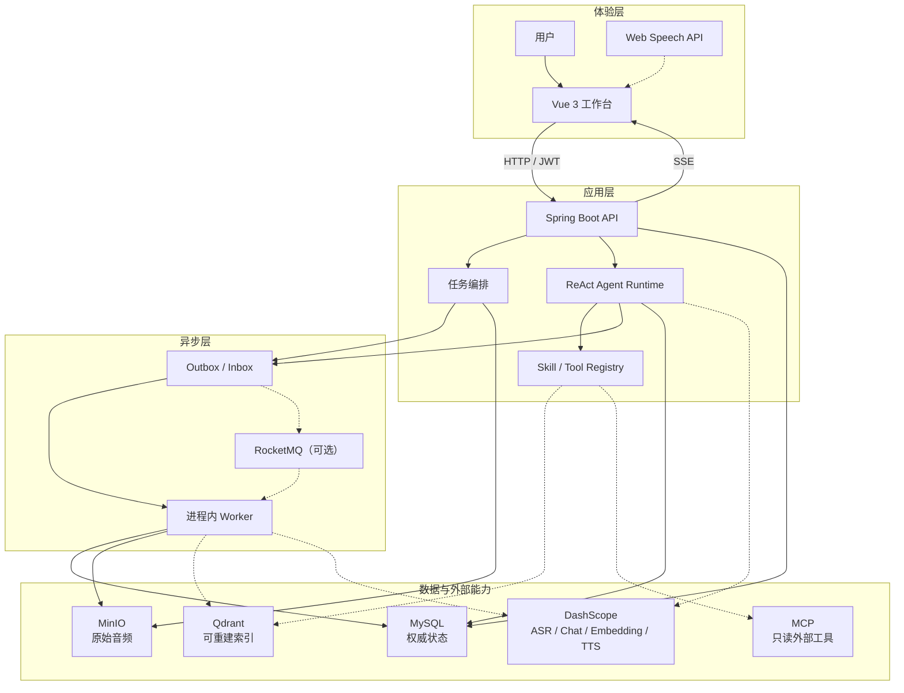

# VoiceNote

> 把音频转化为可校对、可检索、可追溯回答的个人知识库。

VoiceNote 面向会议、访谈与面试等音频场景。它不只完成 ASR 转写，还把原始音频、说话人、时间轴、正式文档、摘要和问答证据组织在同一条可回查链路中。

用户可以从一段录音出发，完成听记校对、知识库构建和跨文档追问；Agent 会在固定资料范围内自主选择只读工具，并把回答引用回本轮真实读取的原文。

[项目总览](#项目总览) · [核心亮点](#核心亮点) · [功能介绍](#功能介绍) · [系统架构](#系统架构) · [Quick Start](#quick-start) · [当前边界](#当前边界)


## 项目总览

| 用户场景 | 可以完成的操作 | 系统提供的保障 |
| --- | --- | --- |
| 音频听记 | 导入录音，查看转写阶段、说话人和时间轴 | 长任务异步执行，阶段状态、耗时和失败位置持久化。 |
| 原文校对 | 播放原音、修改说话人，或审核 AI 校正建议 | 人工修改优先；过期 AI 建议不能覆盖新的修订。 |
| 文档整理 | 生成按主题组织的正式文档和带来源摘要 | 每个 Topic、问答对和摘要结论保留原始 Segment 引用。 |
| 知识检索 | 在当前、勾选或全部已入库录音中检索 | Dense + BM25 混合召回，命中后仍按用户和索引版本回查。 |
| Agent 问答 | 自动匹配 Skill，多轮调用只读 Tool，查看结构化答案 | 固定会话范围、执行预算和证据账本，终态再次校验引用。 |
| 能力扩展 | 创建私人 Skill，查看 Tool 权限，按部署接入 MCP | Skill 版本不可原地修改；MCP 只暴露白名单内的只读工具。 |
| 语音交互 | 连续语音提问，接收实时进度和可选 TTS 朗读 | 语音模式复用同一 Agent Run、证据校验和记忆边界。 |

## 核心亮点

### ReAct Agent 与可观测执行链路

Agent Runtime 以版本化 ReAct 状态机执行开放性任务：模型先匹配或使用指定 Skill，再在预算范围内反复决策、调用 Tool、读取结果并继续规划，最终必须通过 `finalize_answer` 提交结构化答案。服务端限制模型调用、Agent Turn、Tool Call、活动时间和输出大小，不把边界只交给 Prompt。

每个 Model、Tool、Finalize 和 Recovery 步骤都会持久化状态、脱敏输入输出、耗时、Token、错误码和 Checkpoint。Tool 失败会作为独立步骤保留，后续调用仍可追踪；Worker 租约过期后从最近 Checkpoint 恢复，用户也可以从稳定 Checkpoint 创建子 Run 回放，原轨迹不会被覆盖。

相关实现：

- [AgentRuntime](backend/src/main/java/com/voicenote/service/AgentRuntime.java)：ReAct 状态机、预算、Tool Call 和终止条件。
- [KnowledgeAgentService](backend/src/main/java/com/voicenote/service/KnowledgeAgentService.java)：保存 Run、Step、证据账本、恢复记录和回放关系。
- [AgentCheckpointStore](backend/src/main/java/com/voicenote/service/AgentCheckpointStore.java)：序列化、校验并恢复版本化执行状态。

### Skill 与 MCP 扩展

Skill 把场景能力封装成可版本化单元，包含 Instructions、正负触发样例、允许的 Tool、输出区块和按需读取的参考资料。内置 Skill 覆盖知识问答、会议总结和面试复盘；私人 Skill 可以手工创建或由 AI 生成 Draft，发布后才能被手动选择，通过触发预览后才可以开启自动路由；历史 Run 始终冻结原版本。

Tool 的输入使用 JSON Schema 校验，Tools 中心可以按 Skill 查看实际授权、运行条件和协议。部署环境还可以通过 MCP SDK 接入钉钉等外部服务；只有通过部署白名单、名称安全检查和只读校验的 Tool 才会注册，私人 Skill 不能调用 MCP。

相关实现：

- [AgentSkillRegistry](backend/src/main/java/com/voicenote/agent/AgentSkillRegistry.java)：加载内置和已发布私人 Skill，并执行范围匹配。
- [SkillService](backend/src/main/java/com/voicenote/service/SkillService.java)：管理 Draft、触发测试、发布版本和渐进式资源。
- [AgentToolRegistry](backend/src/main/java/com/voicenote/agent/AgentToolRegistry.java)：合并本地与 MCP Tool，并计算每个 Skill 的最小权限集合。
- [McpReadOnlyToolProvider](backend/src/main/java/com/voicenote/agent/McpReadOnlyToolProvider.java)：发现、过滤并包装部署批准的只读 MCP Tool。

### 可追溯混合 RAG

正式文档先按说话人轮次形成完整内容单元，再由模型组织为 Topic、问答对或叙述。知识切片以 Topic 为主要边界，保留说话人、时间范围和原始 Segment；过长 Topic 按 Embedding Provider 实际返回的 Token 用量拆分，短 Topic 只在不超过目标上限时合并。

Qdrant 同时维护 Dense 向量和 BM25 稀疏向量，通过 RRF 融合候选，并可在多文档范围内进行 Rerank。Tool 返回的 Chunk 仍会按用户、文档和冻结的索引 generation 回查 MySQL；最终 `sourceRef` 可以回到对应原文和音频时间位置。

相关实现：

- [DocumentOrganizationService](backend/src/main/java/com/voicenote/service/DocumentOrganizationService.java)：按说话人轮次构建可追溯正式文档。
- [KnowledgeChunker](backend/src/main/java/com/voicenote/service/KnowledgeChunker.java)：按 Topic、内容单元和 Token 上限生成 Chunk。
- [QdrantKnowledgeVectorStore](backend/src/main/java/com/voicenote/service/QdrantKnowledgeVectorStore.java)：构建 Dense + BM25 + RRF 查询。
- [KnowledgeSearchService](backend/src/main/java/com/voicenote/service/KnowledgeSearchService.java)：执行跨文档覆盖、Rerank、上下文预算和版本复核。

### 长任务与三层幂等

音频转写、正式文档生成、索引构建和分析任务都通过 Outbox 驱动，默认可在进程内执行，也可以交给 RocketMQ 至少一次投递。MySQL 保存任务和阶段状态，消息队列不是业务状态来源。

系统从三个层面避免重复工作：上传内容以 SHA-256 去重，请求通过 `Idempotency-Key` 和任务语义约束复用既有资源，消费者使用 Inbox 的 `(consumer_name, message_id)` 唯一键去重。每个阶段单独记录尝试、重试时间和失败原因，恢复协调器只推进仍能安全继续的状态，避免重复 ASR 和并发建单造成的数据分叉。

相关实现：

- [UploadService](backend/src/main/java/com/voicenote/service/UploadService.java)：校验上传意图、字节流哈希和对象写入租约。
- [TranscriptionTaskService](backend/src/main/java/com/voicenote/service/TranscriptionTaskService.java)：按请求键和任务语义创建或复用转写任务。
- [OutboxService](backend/src/main/java/com/voicenote/service/OutboxService.java)：在业务事务中创建带去重键的事件。
- [TaskMessageHandler](backend/src/main/java/com/voicenote/messaging/TaskMessageHandler.java)：用 Inbox 唯一键消费事件并在提交后启动 Worker。

### 人工与 AI 双重说话人校准

用户可以在原始文档中选择单句或连续片段，人工改派到已有说话人；也可以启动 AI 语义校正，让模型结合相邻发言提出整段改派或句内拆分建议。AI 只生成建议，界面展示建议类型、置信度和修改前后内容，用户选择后才会应用。

创建 AI Run 时会冻结转写版本、说话人修订号和原文哈希；应用时再次检查 Run、建议归属和当前修订号。人工在分析期间产生新修订后，旧建议会变为不可应用；有效修改会使正式文档、摘要和知识索引进入待重建状态，避免新原文与旧派生内容混用。

相关实现：

- [SpeakerCorrectionService](backend/src/main/java/com/voicenote/service/SpeakerCorrectionService.java)：冻结快照、持久化建议并执行应用前校验。
- [SpeakerCorrectionWorker](backend/src/main/java/com/voicenote/service/SpeakerCorrectionWorker.java)：分块调用模型并过滤越界输出。
- [TranscriptSpeakerCorrectionService](backend/src/main/java/com/voicenote/service/TranscriptSpeakerCorrectionService.java)：应用人工或 AI 改派并失效派生内容。
- [SpeakerCorrectionTimingAligner](backend/src/main/java/com/voicenote/service/SpeakerCorrectionTimingAligner.java)：为句内拆分生成确定性时间对齐结果。

## 功能介绍

### 1. 导入音频并观察处理进度

资料库是完整链路的入口。用户选择音频后，可以开启说话人识别并按需填写人数；上传完成后页面继续显示转写和后续阶段，不需要停留等待同步请求。列表同时展示每份录音的时长、完成度、当前状态，以及是否可以加入跨文档问答范围。


*资料库集中展示导入入口、最近录音、处理状态和全部/勾选资料范围内的知识问答。*

进入单条录音后，“处理进度”会展开上传、ASR 提交与轮询、正式文档和知识索引等阶段，显示排队时间、执行耗时、实际模型、错误位置和可用的重试操作。知识构建还会分别展示 Topic 入库、Chunk 生成和索引写入数量。


*每个长任务阶段独立持久化；刷新页面或消息重复投递不会丢失权威状态。*

### 2. 对照原音校对原始文档

录音详情页保留原音播放器和带时间位置的完整 ASR 转写。用户可以填写说话人名称、点击片段回到对应音频，并在原始文档、正式文档和 AI 摘要之间切换；原始文档始终是后续整理和检索的来源基线。

说话人校对同时提供人工和 AI 两条路径：局部错误可以直接选择句子后批量改派，复杂的串音或说话人漂移可以交给 AI 分析。AI 结果不会直接改写原文，而是以可勾选建议展示整段改派、句内拆分、置信度和修改前后内容。


*用户可以只选择高置信建议，也可以继续人工校对；过期建议不能覆盖新的修订。*

### 3. 生成完整的正式文档

原始文档确认后，用户手动启动正式文档生成。系统先按连续说话人合并 Turn，再让模型在不遗漏 Turn 的约束下组织 Topic、问答对和叙述单元；模型只能调整结构和有限润色，不能改变来源身份。模型不可用或输出不合法时，可以退回确定性整理结果。


*正式文档保留完整内容和时间范围，不用摘要替代原始事实。*

### 4. 从摘要结论回到原文

AI 摘要是正式文档上的可选派生内容。用户可以查看重点、结论和分组发现，并从每一项证据直接回到对应原始转写和音频位置。摘要生成失败不会影响原始文档、正式文档或现有知识索引。


*结论旁的“回到原文”来自持久化证据引用，而不是模型临时生成的文字位置。*

### 5. 建立知识库并跨文档追问

正式文档准备完成后，用户可以手动建立知识库。每次构建创建独立 index generation，全部 Chunk 写入并验证成功后才切换活动版本；构建失败时继续使用旧版本。资料库支持在全部已入库资料或手动勾选的录音中提问，录音详情页也支持不依赖全局索引的当前文档问答。

Agent 会锁定用户、资料范围、内容版本、时区和会话首次选择的 Skill。它可以先读文档概览，再进行混合检索、补充相邻原文、读取 Skill 资源，并把 Tool 实际读取的来源写入证据账本；最终答案只能引用账本中仍属于当前范围和版本的 `sourceRef`。

### 6. 查看 Trace、定位失败并从 Checkpoint 回放

每轮回答都可以展开“依据与运行轨迹”。界面区分 Skill 选择、Agent 决策、Tool 调用、证据校验和恢复步骤，显示耗时、Token 和脱敏后的可观察输入输出；失败步骤会保留错误码和位置，便于判断问题来自模型、Tool、预算还是运行环境。


*从 Checkpoint 重新执行会创建保留剩余预算的子 Run，不修改原 Run、答案或 Trace。*

### 7. 配置 Skill，检查 Tool 与 MCP 权限

Skill 设置页同时展示内置 Skill 和当前账号创建的私人 Skill。私人 Skill 编辑器按目标与触发、Instructions、Tool 与输出协议、渐进式资源、正负触发测试和发布依次组织；发布版本不可原地修改，后续编辑会产生新的 Draft。


*AI 草拟只使用用户填写的目标和样例，结果始终先保存为 Draft。*

Tools 中心按“范围定位、证据检索、上下文补充、结果校验、MCP 扩展”展示进程实际注册的工具。切换 Skill 后可以看到最小 Tool 集合、运行时条件和输入 Schema；MCP 连接失败不会隐藏或阻断本地 Tool 目录。


*“已注册”“Skill 已授予”和“运行时可用”是不同状态，界面会分别呈现。*

### 8. 使用连续语音 Agent

语音模式通过浏览器识别用户问题，停顿后提交到同一 Agent 会话。服务端使用 SSE 推送固定阶段和已校验的完整答案区块；启用 TTS 时可以朗读短文本，识别或朗读失败只降级当前交互，不改变已经持久化的 Run。


*原始麦克风音频不保存；长期记忆只使用用户明确确认的内容。*

详细的打断、断线和 TTS 边界见 [语音 Agent 实时反馈设计](docs/voice-agent-realtime.md)。

## 系统架构



实线表示基础请求和状态链路，虚线表示按配置启用的模型、检索、消息队列或外部能力。

| 组件 | 数据边界 |
| --- | --- |
| MySQL | 保存账号、任务、阶段、文档版本、Agent Run、证据、Outbox/Inbox 和 Checkpoint，是权威状态来源。 |
| MinIO | 保存原始音频对象；数据库保存所有权、哈希和对象引用。 |
| Qdrant | 保存可从 MySQL 正式文档和索引版本重建的 Dense + BM25 数据，不决定活动版本。 |
| RocketMQ | 可选的至少一次投递通道；重复消息仍由 Inbox 和业务约束去重。 |
| DashScope / MCP | 外部能力按配置启用；失败时由对应任务或 Agent Step 显式记录，不隐藏错误。 |

## 技术栈

| 层次 | 技术 | 在项目中的职责 |
| --- | --- | --- |
| Web | Vue 3、TypeScript、Vite | 资料库、录音工作台、说话人审核、证据展开和语音交互。 |
| API | Java 17、Spring Boot 3、Spring Security | HTTP API、JWT 用户隔离、输入校验、事务和 Agent 边界。 |
| 权威数据 | MySQL、Flyway、Spring Data JPA | 保存任务、版本、会话、证据、Outbox/Inbox 和 Trace。 |
| 对象存储 | MinIO | 保存原始音频。 |
| 异步投递 | 进程内 Publisher、可选 RocketMQ | 驱动 ASR、文档、索引、分析、Agent 和记忆任务。 |
| 检索 | Qdrant | 保存版本化 Dense + BM25 可重建索引。 |
| 模型能力 | DashScope | 按配置提供 ASR、Chat、Embedding、Rerank 和 TTS。 |
| 外部工具 | Model Context Protocol SDK | 按部署白名单注册只读 MCP Tool。 |

## Quick Start

### 前置条件

必需：

- JDK 17、Maven、Node.js
- 可访问的 MySQL 与 MinIO

按需启用：

- RocketMQ：跨进程消息投递
- Qdrant：知识索引和长期记忆检索
- DashScope 凭据：ASR、Chat、Embedding、Rerank 与 TTS
- MCP 服务：部署批准的只读外部 Tool

> 仓库当前不包含 Docker Compose 或生产部署配置，因此这里不提供无法直接执行的容器命令。

### 启动后端

```bash
cd backend
cp .env.example .env
# 至少配置 MySQL、MinIO 和 VOICENOTE_JWT_SECRET
mvn spring-boot:run
```

后端默认监听 `http://localhost:8080`。确认应用启动：

```bash
curl http://localhost:8080/actuator/health
```

### 启动前端

```bash
cd frontend
npm install
npm run dev
```

Vite 默认监听 `http://localhost:5173`，并将 `/api` 代理到本地 `8080` 端口。

### 可选能力配置

完整变量和安全占位值见 [`backend/.env.example`](backend/.env.example)。真实凭据、私有地址和对象存储配置只能放在本地 `.env` 或部署环境中。

| 能力 | 关键开关 |
| --- | --- |
| RocketMQ 消费 | `ROCKETMQ_ENABLED=true` |
| ASR、Chat 与 Embedding | `DASHSCOPE_ENABLED=true` 与 `DASHSCOPE_API_KEY` |
| 知识索引 | `VOICENOTE_KNOWLEDGE_ENABLED=true` 与 `VOICENOTE_QDRANT_URL` |
| ReAct Agent | `VOICENOTE_AGENT_ENABLED=true` |
| 长短期记忆 | `VOICENOTE_MEMORY_ENABLED=true` |
| TTS 朗读 | `VOICENOTE_TTS_ENABLED=true` |
| 只读 MCP Tool | `VOICENOTE_MCP_ENABLED=true` 与部署环境中的服务映射 |

## 项目结构

```text
.
├── backend/
│   ├── src/main/java/com/voicenote/     # API、领域模型、Service、Worker 与 Provider
│   ├── src/main/resources/agent-skills/ # 内置 Skill、模板、参考资料与示例
│   ├── src/main/resources/db/           # Flyway 迁移
│   └── src/main/resources/prompts/      # 版本化模型 Prompt
├── frontend/src/                        # Vue 工作台、Agent 与语音交互
├── docs/                                # 设计说明与产品截图
└── scripts/                             # Agent 评测和本地开发辅助脚本
```

## 关键 API

| 资源 | API | 用途 |
| --- | --- | --- |
| 认证 | `/api/auth/*` | 注册、登录并获取 JWT。 |
| 上传 | `/api/uploads/intents/*` | 创建上传意图、写入音频并完成校验。 |
| 听记任务 | `/api/transcription-tasks/*` | 读取阶段、重试、校正、生成正式文档和建立索引。 |
| 文档与分析 | `/api/organized-documents/*`、`/api/analysis-runs/*` | 读取正式文档并生成带证据摘要。 |
| Agent 会话 | `/api/agent-conversations/*`、`/api/agent-runs/*` | 创建固定范围会话、提交 Turn、查看 Trace 和回放。 |
| 实时事件 | `/api/progress-events` | 通过 SSE 接收处理进度和语音 Agent 瞬时区块。 |

创建资源的接口普遍要求 `Idempotency-Key`；业务资源会再次按 JWT 中的用户身份校验所有权。

## 验证

后端测试覆盖状态机、幂等、对象存储错误、阶段恢复、知识切片、说话人校正、Tool 参数边界、证据校验、Checkpoint 和记忆生命周期。前端构建会同时执行 Vue 类型检查。

```bash
cd backend
mvn test

cd ../frontend
npm run build
```

Agent 脱敏评测数据格式和指标计算见 [Agent 评测说明](docs/agent-evaluation.md)。仓库只记录可复现的评测定义，不声明尚未在目标模型、真实 Qdrant 索引和脱敏音频集上复现的检索分数。

## 当前边界

- 项目仍处于开发阶段；外部 ASR、模型、Qdrant、RocketMQ、MCP、记忆和 TTS 需要按环境启用。
- 账号密码登录和 JWT 用户隔离已经实现，但当前不是具备组织级 RBAC 的多租户管理后台。
- 长期记忆默认关闭，只保存用户确认的内容，不支持团队共享。
- 私人 Skill 仅创建者可见，只能调用本地只读 Tool；MCP 仅接受部署配置和内置 Skill 白名单。
- 音频、文档、索引和 Agent 结果按认证用户隔离。真实凭据、私有服务地址、对象存储路径和租户标识不得提交到仓库。
- 当前没有 Docker Compose 或生产部署配置，也没有对外承诺未经目标环境复现的检索质量指标。

## Roadmap

- 提供可复现的 Docker Compose 与生产部署配置。
- 增加组织、角色和权限管理，以及团队资料与记忆共享边界。
- 支持私人 Skill 的导入、导出、版本迁移与团队共享。
- 在目标模型和脱敏数据集上建立检索、引用、拒答与语音交互基线。

## 设计文档

- [Agent 长短期记忆设计](docs/agent-memory.md)
- [语音 Agent 实时反馈设计](docs/voice-agent-realtime.md)
- [Agent 评测说明](docs/agent-evaluation.md)
