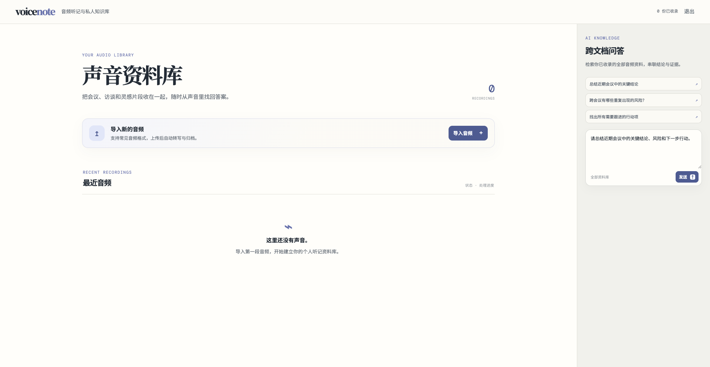
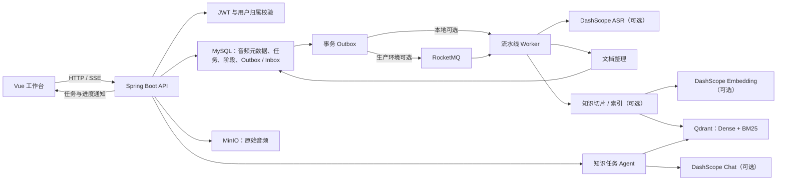

# voicenote

> 开发中 · 面向会议、面试与访谈的 AI 听记和个人知识库

voicenote 将上传的音频保存为带时间轴的听记记录，并把完成的转写整理为可检索的知识文档。它面向“录了很多、回看很难”的场景：既能回到具体音频片段核对原文，也能在自己的资料库中提出开放问题。

当前版本的主链路是：上传音频 → 说话人转写 → 文档整理 → 知识切片与索引 → 证据可回跳的跨文档问答。项目正在持续开发，外部 ASR、向量检索和模型能力需要按环境单独启用。



*声音资料库工作台：左侧导入与管理音频，右侧提交跨文档问题。截图展示的是空资料库状态。*

## 当前能力

| 能力 | 已实现的行为 |
| --- | --- |
| 音频导入 | 创建上传意图时按用户和音频 SHA-256 复用内容记录；流式上传时重新计算 SHA-256，校验通过后才允许创建听记任务。 |
| 异步听记 | 任务创建立即返回，不等待 ASR 完成。转写、文档整理、知识构建由持久化任务和消息事件驱动；每个阶段的状态、尝试次数与失败信息可查询。 |
| 说话人和时间轴 | 转写段保存时间范围、段序号与说话人信息；界面可根据证据定位到对应的音频时间。 |
| 文档沉淀 | 听记完成后创建整理文档及其区块，保留其来源转写段，供摘要和知识构建使用。 |
| 私有知识库 | 在启用知识库集成时，为用户的整理文档生成带主题、说话人、时间戳与来源片段的知识块，并写入 Qdrant。 |
| 跨文档问答 | Agent 以一次性知识任务运行，能够检索并读取已召回片段；答案中的每条证据都会校验为它实际读取过的转写段。 |
| 实时进度 | 工作台通过认证后的 SSE 接收阶段完成、索引完成和知识任务完成通知。 |

> **当前边界：**账号密码登录与 JWT 用户隔离已经实现；这不是一个具备组织、角色或权限管理的多租户后台。启用 `DASHSCOPE_ENABLED` 后才会调用 ASR、Embedding 和对话模型；启用 `VOICENOTE_KNOWLEDGE_ENABLED` 后才会执行向量知识构建。

## 架构概览



任务的权威状态在 MySQL；RocketMQ 按至少一次投递处理，而不是作为状态来源。RocketMQ 未启用时，应用仍可使用进程内消息发布器驱动开发环境的 Worker。

## 典型使用流程

1. 登录后选择音频，客户端计算内容 SHA-256 并创建上传意图。
2. 上传完成后创建听记任务。页面会展示 ASR、文档整理和知识索引阶段的进度；失败阶段可按阶段重试。
3. 在音频详情页阅读逐段转写、整理文档或摘要；点击引用可跳至关联音频时间。
4. 当知识构建完成后，在右侧输入跨文档问题。Agent 会从当前用户的资料中检索、读取片段并返回带证据的结果。

## 本地启动

### 前置条件

- JDK 17、Maven 与 Node.js
- 可访问的 MySQL 与 MinIO
- 可选：RocketMQ（异步消息）、Qdrant（知识检索）、DashScope 凭据（ASR、Embedding、对话模型）

后端从 `backend/.env` 读取本地配置，进程环境变量优先级更高。复制示例文件后，将其中的占位值替换为本地环境值；不要提交真实凭据、私有地址或对象存储信息。

```bash
cd backend
cp .env.example .env
# 编辑 .env：至少配置 MySQL、MinIO 与 VOICENOTE_JWT_SECRET
mvn spring-boot:run
```

默认后端端口为 `8080`。另开一个终端启动前端：

```bash
cd frontend
npm install
npm run dev
```

### 按需启用外部能力

| 目标 | 配置 |
| --- | --- |
| 启用异步 MQ 消费 | `ROCKETMQ_ENABLED=true`，并配置 `VOICENOTE_ROCKETMQ_NAMESRV`。 |
| 启用 ASR、问答与向量 Embedding | `DASHSCOPE_ENABLED=true`，设置 `DASHSCOPE_API_KEY`，必要时调整模型名。 |
| 启用知识文档索引 | `VOICENOTE_KNOWLEDGE_ENABLED=true`，并配置可访问的 `VOICENOTE_QDRANT_URL`。 |

`backend/.env.example` 列出了完整的变量、默认模型名和本地端口示例。外部能力关闭时，应用不会主动连接 DashScope 或 RocketMQ；知识构建需要 Qdrant 与 Embedding 同时可用。

## 关键设计

### 三层幂等，避免重复转写

同一用户上传相同内容时，`audio_blobs` 的 `(owner_id, sha256)` 唯一约束会复用音频记录；上传过程还会对实际字节流再做一次 SHA-256 校验。创建任务时，`Idempotency-Key` 与请求哈希一起保存，任务本身还以音频、ASR 配置和流水线版本形成语义唯一键。这样可同时处理重复点击、并发建单和重放请求，避免不必要地再次提交 ASR。

相关实现：

- [UploadService](backend/src/main/java/com/voicenote/service/UploadService.java)：创建或复用上传意图，并对上传字节流校验摘要。
- [TranscriptionTaskService](backend/src/main/java/com/voicenote/service/TranscriptionTaskService.java)：以请求幂等记录和语义键创建任务。
- [V1 初始表结构](backend/src/main/resources/db/migration/V1__initial_schema.sql)：声明音频、请求幂等记录与听记任务的唯一约束。

### 持久化阶段状态与可靠投递

任务创建和 Outbox 事件写入同一事务。Dispatcher 将待投递事件送往 RocketMQ；消费者使用 Inbox 的 `(consumer_name, message_id)` 唯一约束去重。每个处理阶段都有独立尝试记录，Worker 重启后会恢复仍在排队或应重试的工作；未知的 ASR 提交结果不会自动再次提交，避免外部模型调用不确定时产生重复成本。

相关实现：

- [OutboxService](backend/src/main/java/com/voicenote/service/OutboxService.java)：创建带去重键的 Outbox 事件。
- [TaskMessageHandler](backend/src/main/java/com/voicenote/messaging/TaskMessageHandler.java)：在消费端登记 Inbox 并分派任务事件。
- [PipelineProgressService](backend/src/main/java/com/voicenote/service/PipelineProgressService.java)：维护阶段状态、进度和阶段级重试。
- [PipelineRecoveryCoordinator](backend/src/main/java/com/voicenote/service/PipelineRecoveryCoordinator.java)：定期恢复可继续执行的任务。

### 保留语义边界的知识切片

知识块从整理文档的主题、问答对和叙述区块中生成，而非按固定字符数机械截断。每块保存主题、起止时间、来源转写段、说话人和前文上下文；当主题切换或达到模型返回的 Token 上限时切分，过大的原子单元再下钻到来源片段。这使检索结果能够回到具体的说话人和原文时间范围。

相关实现：

- [KnowledgeChunker](backend/src/main/java/com/voicenote/service/KnowledgeChunker.java)：按主题与模型 Token 用量生成带来源片段的知识块。
- [KnowledgeIndexWorker](backend/src/main/java/com/voicenote/service/KnowledgeIndexWorker.java)：在整理文档就绪后构建并写入知识索引。
- [QdrantKnowledgeVectorStore](backend/src/main/java/com/voicenote/service/QdrantKnowledgeVectorStore.java)：维护 Dense 与 BM25 的混合检索请求。

### Agent 只在开放任务中使用工具

转写、文档整理、切片与索引是由阶段流水线编排的固定流程；开放式问答才创建独立的 Agent 任务。Agent 具有最多四次工具调用额度，读取到的知识块会进入允许引用的集合；服务端拒绝引用未读片段或没有证据的结果。这个边界将核心处理链路的可恢复性与问答任务的灵活性分开。

相关实现：

- [KnowledgeAgentWorker](backend/src/main/java/com/voicenote/service/KnowledgeAgentWorker.java)：执行检索与阅读工具循环。
- [KnowledgeAgentService](backend/src/main/java/com/voicenote/service/KnowledgeAgentService.java)：限制工具预算并校验证据。
- [KnowledgeSearchService](backend/src/main/java/com/voicenote/service/KnowledgeSearchService.java)：按当前用户筛选检索命中并还原可读知识块。

## 项目结构

```text
.
├── backend/
│   ├── src/main/java/com/voicenote/  # API、领域模型、Worker、消息与外部 Provider
│   ├── src/main/resources/db/        # Flyway 迁移
│   └── .env.example                  # 本地配置模板
├── frontend/
│   └── src/                          # Vue 工作台与 API 客户端
├── docs/images/                      # README 展示图
└── scripts/                          # 本地开发辅助脚本
```

## 验证

后端包含状态机、幂等、上传、对象存储、知识切片和 Agent 证据校验等单元测试；前端构建同时执行 Vue 类型检查。

```bash
cd backend
mvn test

cd ../frontend
npm run build
```

## 开发边界与后续工作

- 本项目仍处于开发阶段，必须在真实音频集与目标问题集上再评估转写、检索和问答质量；README 不声明未在仓库中复现的 Hit@5 或其他指标。
- 外部服务由开发环境单独提供，仓库未包含 Docker Compose 或生产部署配置。
- 角色管理、多租户协作、生产可观测性与端到端效果评测尚不在当前 README 所描述的实现范围内。

## 安全说明

音频、知识文档和检索结果按已认证用户隔离。将数据库、对象存储、模型服务和消息服务的真实地址及凭据只保留在忽略的 `backend/.env` 或部署环境变量中，切勿提交到仓库。
