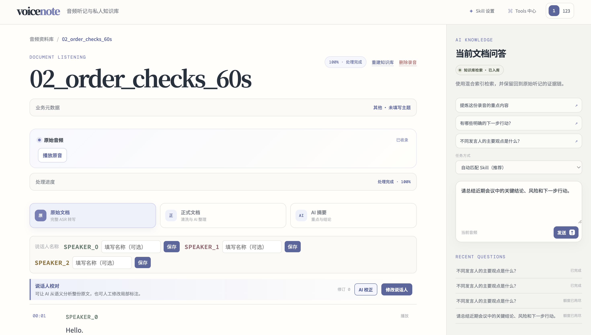

# voice note

> 把录音变成可核对、可检索、能回答问题的个人知识库

voicenote 是一个面向会议、访谈与面试的 AI 音频知识库。它把分散的录音整理成带时间轴、可回听的听记资料，让重要内容不再沉在音频里。

项目解决的不只是“把声音转成文字”，还包括说话人标注难校对、长录音难整理、多份资料难检索，以及 AI 结论难验证。用户可以生成正式文档和摘要，围绕单份或多份录音提问，并通过证据链接回到原文与对应音频位置。

*录音详情工作台把原音、文档、说话人校对和带证据问答放在同一页面。*

## 30 秒了解

| 记录 | 整理 | 检索 |
| --- | --- | --- |
| 上传音频并异步转写，按时间轴回听原文。 | 校正说话人，生成完整的正式文档和 AI 摘要。 | 建立个人知识库，通过受约束的 Agent 获取可回跳原文的答案。 |

## 核心能力

| 能力 | 用户可以做什么 |
| --- | --- |
| 音频听记 | 导入常见音频格式，查看异步处理进度，并按时间戳播放完整转写。 |
| 校对与整理 | 保存说话人名称，人工或通过 AI 建议修正归属，再生成正式文档和摘要。 |
| 个人知识库 | 将确认后的正式文档按 Topic 建立版本化索引，保留每次构建状态。 |
| 证据化问答 | 围绕当前录音、选定资料或全部已入库资料提问，并从结论回到原文和音频。 |
| Skill 与工具权限 | 使用内置或私人 Skill 约束任务、结果结构和可调用的只读工具。 |
| Agent 会话与记忆 | 在固定资料范围内继续追问；长期记忆必须由用户确认，并可随时编辑或删除。 |
| 可观察执行 | 查看听记阶段、Agent 工具调用和 Checkpoint；可重试阶段或从稳定状态创建子 Run。 |

## 产品流程

### 1. 导入并管理音频

资料库集中展示最近录音、处理状态和入库情况。用户可以导入新音频，也可以直接对全部已入库资料或勾选的录音提问。

*资料库首页同时承担音频入口、状态总览和跨文档问答。*

### 2. 查看录音与处理状态

进入单条录音后，可以播放原音、查看处理进度，并在原始文档、正式文档和摘要之间切换。右侧问答区只使用当前录音时，会明确展示当前可用的检索方式。

*单条录音工作台保留从原音到文档、再到当前文档问答的上下文。*

### 3. 校正、整理并生成摘要

原始文档保留完整转写、时间和 ASR 说话人。AI 只提出整段改派或句内拆分建议，用户确认后才应用；人工修订始终优先。

*说话人建议先进入审核列表，不会直接改写原文或自动落库。*

<strong>展开查看处理阶段、正式文档与摘要</strong>

处理进度按阶段展示状态、排队时间、处理耗时和实际模型，便于判断任务停在了哪里。

正式文档是完整转写的清洗整理稿，而不是摘要；它按 Topic、问答对或叙述单元组织，并保留来源时间位置。

AI 摘要提取重点与结论，每项都可以回到支撑它的原文片段。

### 4. 建立知识库并获得可追溯答案

确认正式文档后，可以建立或重建知识索引，再围绕当前录音、选定资料或全部已入库资料提问。Agent 只能访问本次授权的文档和 Skill 允许的工具，最终结论必须引用本次读取的证据。回答默认折叠证据，按需展开后以句级编号对应原文与音频时间点。

<strong>展开查看 Skill、Tools 与 Agent 运行轨迹</strong>

Skill 设置用于管理任务目标、工作流、结果结构、参考资料和触发样例；私人 Skill 可以手工创建或由 AI 生成 Draft 后再发布。

Tools 中心展示当前进程实际注册的工具，并按 Skill 查看运行时权限和输入协议。

回答完成后可以查看脱敏的执行步骤、耗时和 Token 用量；可重放 Checkpoint 会创建新的子 Run，不修改原轨迹。

## 架构概览

~~~mermaid
flowchart LR
    Browser["Vue 工作台"] -->|"HTTP"| Api["Spring Boot API"]
    Api -->|"SSE / 查询结果"| Browser
    Api --> Auth["JWT 用户隔离"]
    Api --> Minio["MinIO：原始音频"]
    Api --> Mysql["MySQL：任务、会话、记忆、索引版本、Agent Run"]

    Mysql --> Outbox["事务 Outbox"]
    Outbox -->|"可选 RocketMQ 或进程内发布"| Workers["异步流水线 Worker"]
    Workers --> Models["DashScope：ASR / Chat / Embedding"]
    Workers --> Mysql
    Workers --> Qdrant["Qdrant：Dense + BM25"]
    Workers --> Agent["有界 Agent：范围、Skill、预算"]

    Agent --> Tools["只读 Tools"]
    Tools --> Mysql
    Tools --> Qdrant
    Agent --> Models
    Agent --> Mysql
~~~

MySQL 保存任务和版本的权威状态；RocketMQ 负责至少一次投递，不作为状态来源。Qdrant 保存可重建的版本化检索索引，问答仍会在 MySQL 中复核用户、文档和活动版本。

主要技术：Vue 3、TypeScript、Spring Boot 3、Java 17、MySQL、MinIO；RocketMQ、Qdrant 与 DashScope 按环境启用。

## 工程亮点

| 设计 | 解决的问题 |
| --- | --- |
| 三层上传幂等 | 处理重复点击、并发建单和请求重放，避免重复提交 ASR。 |
| 持久化异步流水线 | 让任务状态、投递、消费和阶段重试可以恢复与审计。 |
| 人审说话人校正 | AI 只生成受约束的建议，版本冲突或人工修改会阻止旧建议覆盖新结果。 |
| 版本化知识索引 | 新索引完整可用后才切换活动版本，失败构建不会影响当前检索。 |
| 有界证据 Agent | 会话冻结文档身份、时区与 Skill；每轮重新冻结当前内容版本，并由服务端复核引用。 |
| 用户可控记忆 | 短期历史留在会话内，长期候选经用户确认后才可按需检索；MySQL 始终是权威来源。 |

<strong>三层上传幂等：避免重复转写</strong>

同一用户上传相同内容时，`audio_blobs` 的 `(owner_id, sha256)` 唯一约束会复用音频记录；上传过程还会重新计算实际字节流的 SHA-256。创建任务时，`Idempotency-Key` 与请求哈希一起保存，任务本身再以音频、ASR 配置和流水线版本形成语义唯一键。

相关实现：

- [UploadService](backend/src/main/java/com/voicenote/service/UploadService.java)：创建或复用上传意图，并校验实际上传内容。
- [TranscriptionTaskService](backend/src/main/java/com/voicenote/service/TranscriptionTaskService.java)：以请求幂等记录和语义键创建任务。
- [V1 初始表结构](backend/src/main/resources/db/migration/V1__initial_schema.sql)：声明音频、幂等记录与听记任务约束。

<strong>持久化异步流水线：状态不依赖消息队列</strong>

任务与 Outbox 事件在同一事务中写入；消费者通过 Inbox 的 `(consumer_name, message_id)` 唯一约束去重。每个阶段有独立尝试记录，Worker 可以恢复仍在排队或应重试的工作；外部 ASR 提交结果未知时不会贸然重复提交。

相关实现：

- [OutboxService](backend/src/main/java/com/voicenote/service/OutboxService.java)：创建带去重键的 Outbox 事件。
- [TaskMessageHandler](backend/src/main/java/com/voicenote/messaging/TaskMessageHandler.java)：登记 Inbox 并分派任务事件。
- [PipelineProgressService](backend/src/main/java/com/voicenote/service/PipelineProgressService.java)：维护阶段状态、进度和重试。
- [PipelineRecoveryCoordinator](backend/src/main/java/com/voicenote/service/PipelineRecoveryCoordinator.java)：恢复可以继续执行的任务。

<strong>人审说话人校正：AI 不直接修改原文</strong>

AI 校正 Run 冻结转写版本、修订号和原文快照哈希。Worker 只能在已有说话人集合中提出整段改派或句内拆分，不能生成替换文字；提交所选建议时，服务端再次校验 Run 状态、建议归属和当前修订号。

相关实现：

- [SpeakerCorrectionService](backend/src/main/java/com/voicenote/service/SpeakerCorrectionService.java)：冻结快照、幂等创建 Run，并在应用前校验版本。
- [SpeakerCorrectionWorker](backend/src/main/java/com/voicenote/service/SpeakerCorrectionWorker.java)：分块调用模型并解析受约束建议。
- [SpeakerCorrectionTimingAligner](backend/src/main/java/com/voicenote/service/SpeakerCorrectionTimingAligner.java)：对齐句内拆分时间并标记估算来源。
- [版本化 Prompt](backend/src/main/resources/prompts/speaker-correction-v1.md)：保存任务边界和 JSON 输出协议。

<strong>版本化知识索引：构建失败不影响当前检索</strong>

正式文档先生成带来源信息的 Topic 快照，再按模型 Token 用量形成知识块。每次建立或重建都会创建独立 generation；新 Qdrant 点先以 `searchable=false` 写入，全部成功后才开启检索并切换 MySQL 中的活动版本。

相关实现：

- [KnowledgeChunker](backend/src/main/java/com/voicenote/service/KnowledgeChunker.java)：按 Topic 与原子单元生成知识块。
- [KnowledgeDocumentService](backend/src/main/java/com/voicenote/service/KnowledgeDocumentService.java)：创建 generation 并切换活动版本。
- [KnowledgeIndexWorker](backend/src/main/java/com/voicenote/service/KnowledgeIndexWorker.java)：写入向量、启用新版本并下线旧版本。
- [QdrantKnowledgeVectorStore](backend/src/main/java/com/voicenote/service/QdrantKnowledgeVectorStore.java)：执行版本过滤的 Dense + BM25 检索。

<strong>有界证据 Agent：范围、权限、预算和引用均可验证</strong>

每个会话冻结用户、文档身份、时区和首次选定的 Skill；每轮提问仍创建独立 Run，并重新冻结这些文档当前可用的转写或索引版本。模型只能选择允许的只读 Tool，不能提交 ownerId 或扩大范围；Run 同时受模型调用、回合、工具次数、活动时间和输出大小限制。

会话短期上下文由滚动摘要和最近 Turn 组成，只用于指代与任务连续性。长期记忆只从用户消息提取候选，用户确认后才进入 MySQL；Agent 仅在需要时调用 `user_memory_search`，Qdrant 命中还会按当前用户、有效状态和当前版本回查 MySQL。

Tool 读取的来源先进入持久化证据账本。最终回答只接受账本内的 `sourceRef`，完成事务会再次复核文档、索引版本、Chunk、Segment 和结果结构；稳定 Checkpoint 可用于恢复或创建保留剩余预算的子 Run。

相关实现：

- [AgentRuntime](backend/src/main/java/com/voicenote/service/AgentRuntime.java)：执行版本化状态机、Tool Call、预算和终止条件。
- [KnowledgeAgentService](backend/src/main/java/com/voicenote/service/KnowledgeAgentService.java)：保存范围快照、Step、Checkpoint 与证据账本。
- [AgentConversationService](backend/src/main/java/com/voicenote/service/AgentConversationService.java)：锁定会话范围并串行创建 Turn。
- [UserMemoryService](backend/src/main/java/com/voicenote/service/UserMemoryService.java)：执行候选过滤、确认、版本、删除和 MySQL 复核。
- [Agent 记忆设计](docs/agent-memory.md)：说明短期摘要、长期记忆生命周期、配置与安全边界。
- [FinalizeAnswerTool](backend/src/main/java/com/voicenote/agent/tools/FinalizeAnswerTool.java)：约束结果结构和来源引用。
- [SkillService](backend/src/main/java/com/voicenote/service/SkillService.java)：管理私人 Draft、发布版本、触发预览和所有者隔离。
- [Agent 评测说明](docs/agent-evaluation.md)：说明脱敏评测集、结果格式和指标计算。

## 本地启动

### 前置条件

- JDK 17、Maven 与 Node.js
- 可访问的 MySQL 与 MinIO
- 可选：RocketMQ、Qdrant 与 DashScope 凭据

启动后端：

~~~bash
cd backend
cp .env.example .env
# 至少配置 MySQL、MinIO 与 VOICENOTE_JWT_SECRET
mvn spring-boot:run
~~~

默认后端端口为 `8080`。另开一个终端启动前端：

~~~bash
cd frontend
npm install
npm run dev
~~~

<strong>展开查看外部能力与检索参数</strong>

`backend/.env.example` 列出了完整变量和本地默认值。真实凭据、私有地址和对象存储配置应只保存在本地 `backend/.env` 或部署环境中。

| 目标 | 配置 |
| --- | --- |
| RocketMQ 消费 | `ROCKETMQ_ENABLED=true`，并配置 `VOICENOTE_ROCKETMQ_NAMESRV`。 |
| ASR、Chat 与 Embedding | `DASHSCOPE_ENABLED=true`，设置 `DASHSCOPE_API_KEY`。 |
| 知识索引 | `VOICENOTE_KNOWLEDGE_ENABLED=true`，并配置 `VOICENOTE_QDRANT_URL`。 |
| 自主 Agent | `VOICENOTE_AGENT_ENABLED=true`。默认 7 次模型调用、6 个回合、10 次工具调用和 120 秒。 |
| Agent 记忆 | `VOICENOTE_MEMORY_ENABLED=true`。默认关闭；启用后使用独立 Qdrant collection，候选仍需用户确认。 |
| 文本 Rerank | `VOICENOTE_RERANK_ENABLED=true`。失败时降级为 RRF 并在结果中披露。 |
| 只读 MCP | `VOICENOTE_MCP_ENABLED=true`，通过 `VOICENOTE_MCP_SERVERS` 配置服务、认证变量名、只读工具和允许的内置 Skill。未连接的 MCP 不影响主链路。 |

当前知识索引默认按 200 Token 判断短 Topic，目标 Chunk 为 800 Token、最大 1200 Token；问答上下文最多 12 个 Chunk 和 10,000 Token。修改这些参数后，需要重新建立知识库。

MCP 是可选的 Agent Tool 扩展。未配置、连接失败或工具发现失败时，系统不会注册外部工具，上传、转写、索引与既有 Agent 仍按原逻辑运行。配置仅允许部署环境提供地址、命令与认证变量名；不得将凭据写入仓库。

HTTP 示例使用不可解析的占位域名：

~~~json
[{"name":"calendar","baseUrl":"https://mcp.example.invalid","endpoint":"/mcp","authorizationEnv":"CALENDAR_MCP_AUTHORIZATION","readOnlyTools":["list_events"],"allowedSkills":["meeting-summary"]}]
~~~

钉钉官方 MCP 使用 stdio，可按固定版本的 `dingtalk-mcp` 作为可选部署运行时依赖。以下配置示例只传递环境变量名；`readOnlyTools` 必须填写官方服务实际发现的查询工具名，并且不接受 create、update、delete、send 等写工具。所有内置 Skill 可使用已连接的钉钉工具；私人 Skill 始终只能使用本地工具。

~~~json
[{"name":"dingtalk","transport":"STDIO","command":"npx","arguments":["-y","dingtalk-mcp@<PINNED_VERSION>"],"environment":{"DINGTALK_Client_ID":"DINGTALK_CLIENT_ID","DINGTALK_Client_Secret":"DINGTALK_CLIENT_SECRET","ACTIVE_PROFILES":"DINGTALK_ACTIVE_PROFILES"},"readOnlyTools":["getCalendarView","queryTasks","searchUser"],"allowedSkills":["knowledge-qa","meeting-summary","interview-retro"]}]
~~~

`<PINNED_VERSION>` 必须替换为已安全评审和验证的实际版本，不能使用 `latest`。服务端不信任远端的只读声明，也会阻止将已读取的转写原文直接作为 MCP 参数发送。

## 项目结构

~~~text
.
├── backend/
│   ├── src/main/java/com/voicenote/     # API、领域模型、Worker 与 Provider
│   ├── src/main/resources/agent-skills/ # 内置 Skill、模板、参考资料与示例
│   ├── src/main/resources/db/           # Flyway 迁移
│   ├── src/main/resources/prompts/      # 版本化模型 Prompt
│   └── .env.example                     # 本地配置模板
├── frontend/src/                        # Vue 工作台与 API 客户端
├── docs/images/                         # README 展示图
└── scripts/                             # 本地开发辅助脚本
~~~

## 验证

后端包含状态机、幂等、上传、对象存储、知识切片、工具参数边界和 Agent 证据校验等测试；前端构建同时执行 Vue 类型检查。

~~~bash
cd backend
mvn test

cd ../frontend
npm run build
~~~

## 当前边界

- 项目仍处于开发阶段；外部 ASR、模型、Qdrant 和 RocketMQ 需要按环境启用，仓库不包含 Docker Compose 或生产部署配置。
- 账号密码登录与 JWT 用户隔离已经实现，但项目不是具备组织、角色和权限管理的多租户后台。
- Agent 由 `VOICENOTE_AGENT_ENABLED` 灰度启用；会话短期上下文和长期记忆由独立的 `VOICENOTE_MEMORY_ENABLED` 灰度控制，长期记忆不支持团队共享。
- 私人 Skill 仅创建者可见，不支持导入导出、组织共享或市场；私人 Skill 只能使用平台允许的本地只读工具。
- MCP 仅支持部署环境配置、由内置 Skill 声明的只读工具。
- 转写、检索和问答质量仍需在目标模型与脱敏业务数据上评估；README 不声明未复现的质量指标。

## 安全说明

音频、知识文档和检索结果按已认证用户隔离。数据库、对象存储、模型服务和消息服务的真实地址及凭据只能保存在忽略的 `backend/.env` 或部署环境变量中。
