# VoiceNote

> 把录音转化为可校对、可检索、可追溯回答的个人知识库。

VoiceNote 面向会议、访谈与面试等长音频场景：它不只把声音转成文字，还把原音、说话人、正式文档、摘要和问答证据组织在同一条可回查链路中。

项目重点解决三个实际问题：长录音的信息难以定位，自动转写与说话人结果需要校对，AI 给出的结论必须能回到原文和对应音频，而不是停留在不可验证的摘要。

> **个人项目 · 独立完成**：从产品交互、Vue 前端和 Spring Boot 后端，到异步处理流水线、版本化检索、有界 Agent、Skill 与记忆机制，均由作者独立设计和实现。

[30 秒了解](#30-秒了解) · [系统架构](#系统架构) · [产品工作流](#产品工作流) · [核心技术设计](#核心技术设计) · [Quick Start](#quick-start) · [Roadmap](#roadmap)

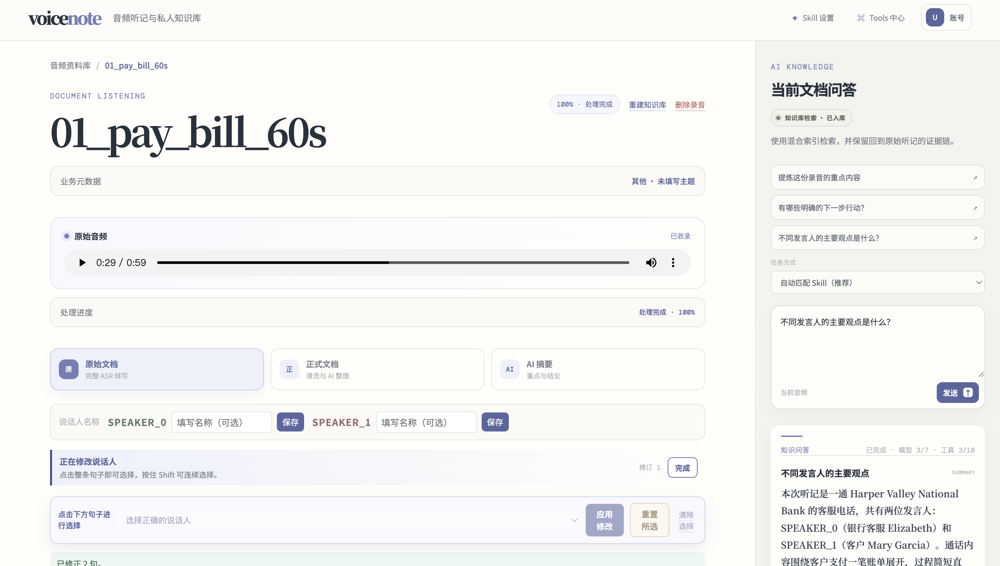

*录音详情工作台把原音、处理状态、文档校对和带证据问答放在同一页面。*

## 30 秒了解

| 业务问题 | VoiceNote 的处理方式 |
| --- | --- |
| 长音频处理时间长，中途失败后难以判断和恢复 | 将上传、ASR、文档整理、索引和分析拆成持久化阶段，记录每次尝试并支持阶段重试。 |
| 自动说话人结果可能标错或在一句内发生切换 | AI 只提交受约束的校正建议；用户审核后再应用，旧建议不能覆盖更新后的转写版本。 |
| 摘要压缩了信息，却切断了结论与原始语境 | 正式文档与摘要保留来源片段，证据可以回跳到说话人、原文和音频时间点。 |
| 多份录音建立索引时，失败构建可能污染当前检索 | 每次构建创建独立 generation；新索引完整可用后才切换活动版本。 |
| Agent 容易扩大数据范围、无限调用工具或生成无来源结论 | 会话冻结资料范围，Skill 限制工具和结果结构，运行时限制预算，并在提交答案前复核证据。 |

## 系统架构

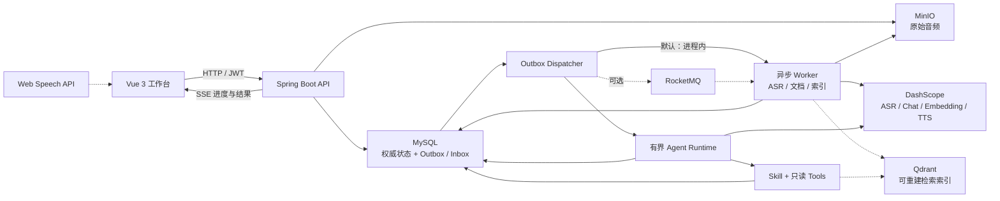

MySQL 保存任务、版本、会话、证据与运行轨迹，是系统的权威状态来源。RocketMQ 只负责可选的至少一次投递；Qdrant 只保存可从 MySQL 文档与版本信息重建的索引。

## 为什么不只是 ASR

| 核心问题 | 工程难点 | 设计回答 |
| --- | --- | --- |
| 录音无法像文档一样快速浏览 | 音频、转写片段、说话人与时间位置需要保持关联 | 保留原始转写与时间轴，再生成不丢失来源的正式文档和摘要。 |
| 自动结果不能直接当作最终事实 | AI 校正可能过期、越界修改文字或与人工编辑冲突 | 冻结转写快照和修订号，限制建议类型，并在应用时再次做并发校验。 |
| RAG 命中不代表答案可信 | 模型可能引用未读取内容、越过资料范围或使用失效索引 | 固定会话范围和内容版本，用证据账本记录 Tool 实际读取的来源，并在终态提交时复核。 |
| 外部模型和消息投递都可能失败 | 请求重放、未知提交结果、重复消息和部分成功会造成状态不一致 | 让业务状态落在 MySQL，以幂等键、Outbox/Inbox、阶段尝试和恢复协调器推进流程。 |

## 产品工作流

### 1. 从音频到可核对文档

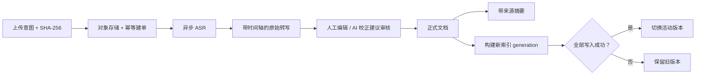

资料库集中展示录音、处理状态和知识库入库情况。进入单条录音后，可以播放原音、按时间轴核对转写，并在原始文档、正式文档和摘要之间切换。

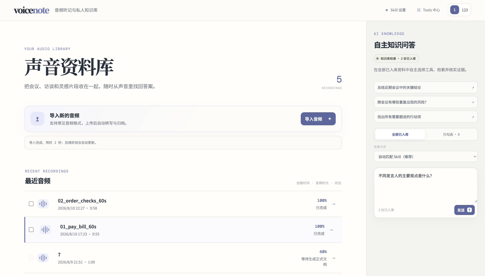

*资料库首页同时承担音频入口、处理状态总览和跨文档问答。*

AI 说话人校正不会直接改写原文。它只能对已有说话人提出整段改派或句内拆分建议，用户确认后才应用。

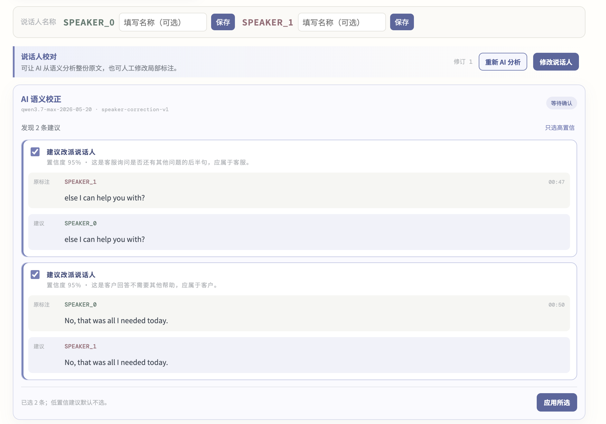

*审核界面同时展示建议类型、置信度与修改前后内容。*

<details>
<summary><strong>查看更多：处理阶段、正式文档与摘要</strong></summary>

处理面板展示每个阶段的排队时间、处理耗时、实际模型和失败位置。

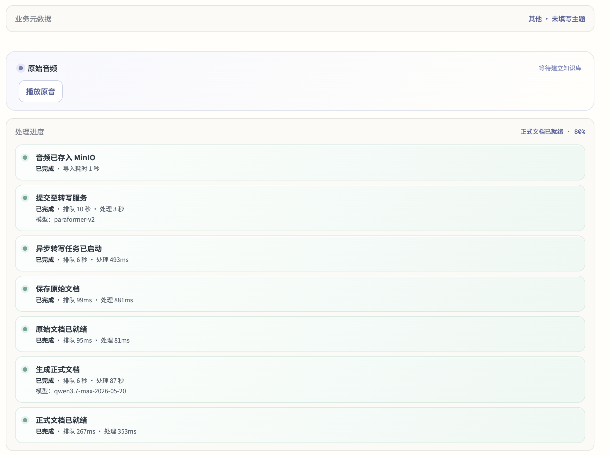

正式文档按 Topic、问答对或叙述单元整理完整内容，而不是只保留摘要。

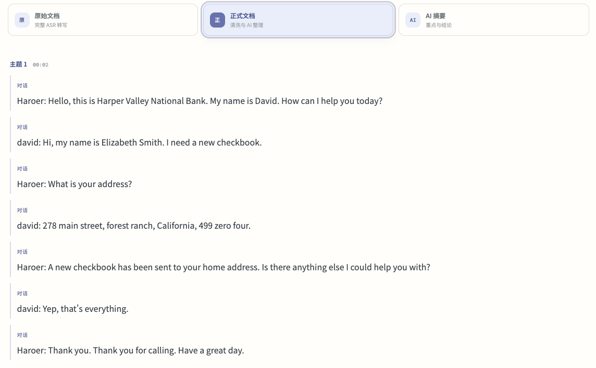

摘要中的结论可以展开证据并回到对应原文。

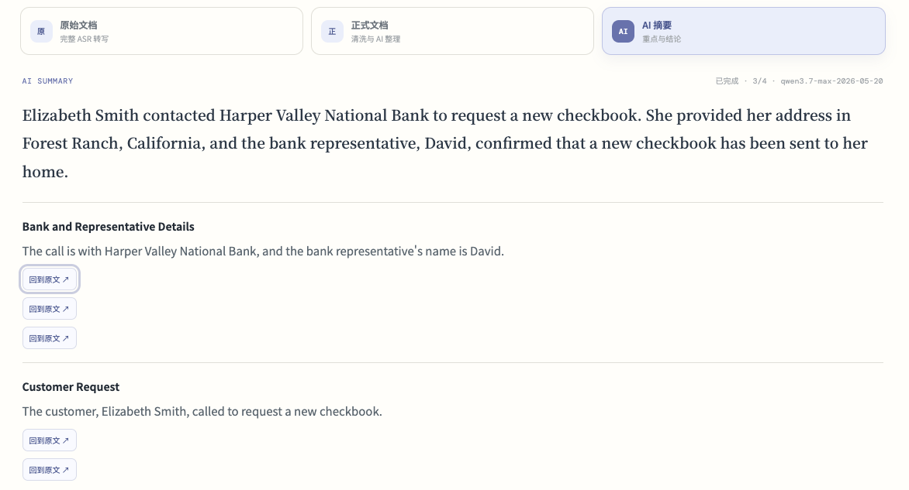

</details>

### 2. 在固定资料范围内获得证据化回答

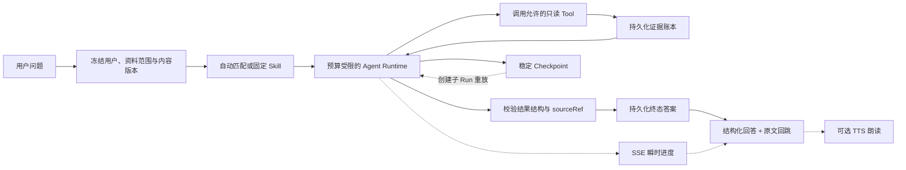

Agent 只能读取当前会话授权的录音和 Skill 允许的工具。Tool 返回的来源先进入证据账本，最终结果只能引用本轮真实读取且仍属于当前版本的 `sourceRef`。

<details>
<summary><strong>查看更多：Skill、Tools 与运行轨迹</strong></summary>

Skill 管理任务目标、触发样例、参考资料、结果区块和可调用工具；私人 Skill 可以由 AI 生成 Draft，但必须发布后才参与匹配。

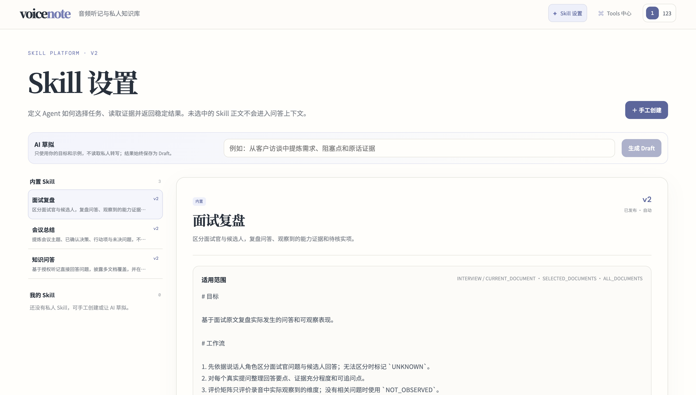

Tools 中心展示当前进程实际注册的工具，以及不同 Skill 的运行时权限。

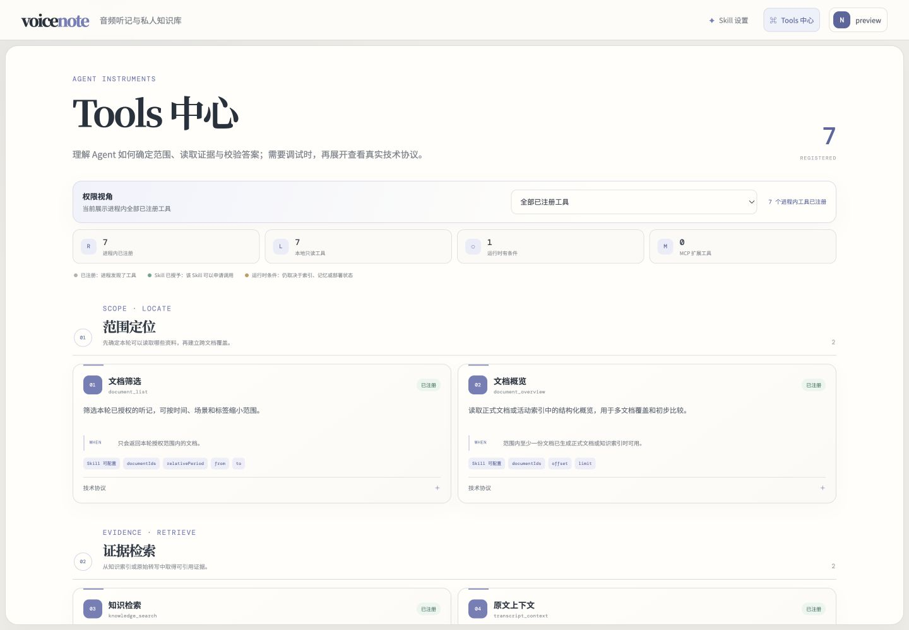

回答完成后可以查看脱敏步骤、耗时和 Token 用量；从 Checkpoint 重放会创建新的子 Run，不修改原轨迹。

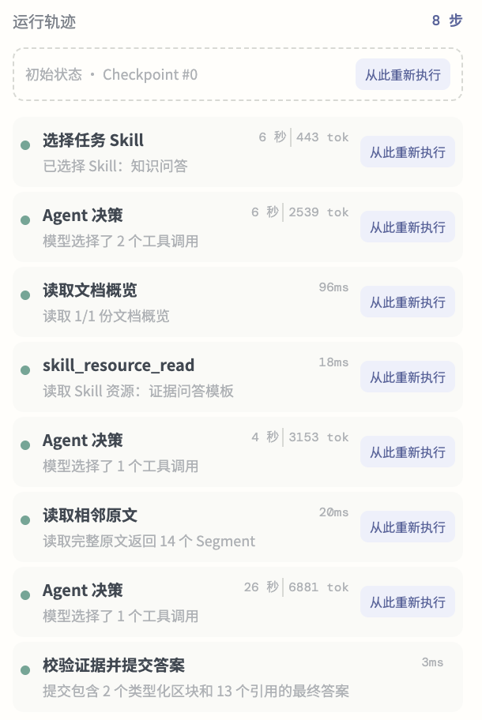

</details>

### 3. 用语音连续提问

语音模式复用同一套 Agent Run、证据校验和长期记忆边界。浏览器负责语音识别；服务端通过 SSE 推送固定阶段和已校验的完整答案区块，不暴露 Prompt、工具参数或隐式推理。

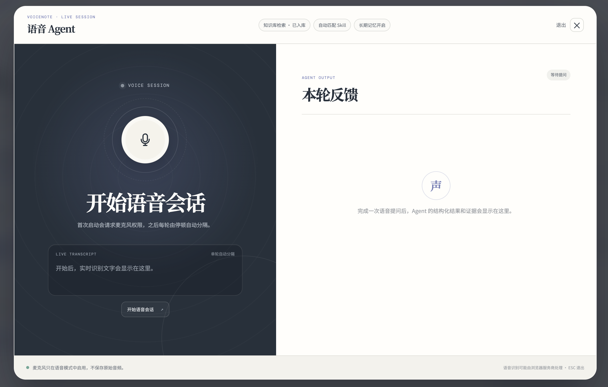

*首次启动时请求麦克风权限；停顿会结束当前轮识别并提交问题，原始音频不会保存。*

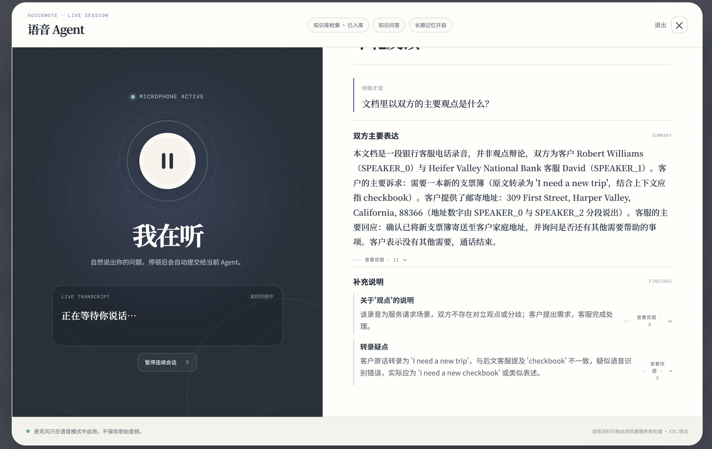

*回答区展示结构化结论和可展开证据；左侧识别下一轮问题。启用 TTS 时，朗读失败只降级为文字，不改变 Agent Run 状态。*

SSE 进度和流式区块是瞬时反馈，断线后以前端重新读取 Run 终态为准。详细边界、打断处理与 TTS 配置见 [语音 Agent 实时反馈设计](docs/voice-agent-realtime.md)。

## 核心技术设计

### 1. 幂等上传与可恢复异步流水线

**问题与难点：** 浏览器重试、重复点击、并发建单和消息重复投递都可能触发重复 ASR；外部 ASR 提交结果未知时，盲目重试还可能创建第二份任务。

**设计与效果：** 上传使用内容 SHA-256、请求 `Idempotency-Key` 和任务语义键三层去重。任务与 Outbox 事件在同一事务中写入，消费者通过 Inbox 唯一键去重；每个阶段记录独立尝试，恢复协调器只推进仍可安全继续的状态。消息队列因此不是任务状态来源，进程重启和重复投递不会直接绕过业务约束。

相关实现：

- [UploadService](backend/src/main/java/com/voicenote/service/UploadService.java)：创建或复用上传意图，并重新计算实际字节流哈希。
- [TranscriptionTaskService](backend/src/main/java/com/voicenote/service/TranscriptionTaskService.java)：保存请求幂等记录并按语义键建单。
- [OutboxService](backend/src/main/java/com/voicenote/service/OutboxService.java)：在业务事务中创建带去重键的事件。
- [PipelineRecoveryCoordinator](backend/src/main/java/com/voicenote/service/PipelineRecoveryCoordinator.java)：恢复可继续执行的任务和阶段。

### 2. 不让过期 AI 建议覆盖人工修订

**问题与难点：** 说话人校正属于对原始转写的写操作。AI 生成建议期间，用户可能已经改名、改派片段或启动了新的校正 Run。

**设计与效果：** 创建 Run 时冻结转写版本、修订号和原文快照哈希；模型只能从已有说话人集合中选择，不能替换文字。应用建议前，服务端再次校验 Run、建议归属和当前修订号，发现并发修改就拒绝旧建议。句内拆分的时间由确定性对齐逻辑生成，并标记是否为估算值。

相关实现：

- [SpeakerCorrectionService](backend/src/main/java/com/voicenote/service/SpeakerCorrectionService.java)：冻结快照并执行应用前的版本检查。
- [SpeakerCorrectionWorker](backend/src/main/java/com/voicenote/service/SpeakerCorrectionWorker.java)：分块调用模型并解析受约束建议。
- [SpeakerCorrectionTimingAligner](backend/src/main/java/com/voicenote/service/SpeakerCorrectionTimingAligner.java)：对齐句内拆分时间。
- [版本化 Prompt](backend/src/main/resources/prompts/speaker-correction-v1.md)：保存校正边界和 JSON 输出协议。

### 3. 索引构建失败不影响当前检索

**问题与难点：** 向量和稀疏索引需要多次外部写入；如果查询直接读取构建中的数据，部分成功会造成结果缺失或版本混用。

**设计与效果：** 正式文档先形成带来源信息的 Topic 快照，再按模型 Token 用量切块。每次构建创建独立 generation，Qdrant 点先以 `searchable=false` 写入；全部阶段成功后才启用新 generation 并切换 MySQL 活动版本，失败时继续使用旧版本。检索命中仍会按用户、文档和活动版本回查 MySQL。

相关实现：

- [KnowledgeChunker](backend/src/main/java/com/voicenote/service/KnowledgeChunker.java)：按 Topic 与原子单元生成知识块。
- [KnowledgeDocumentService](backend/src/main/java/com/voicenote/service/KnowledgeDocumentService.java)：创建 generation 并维护活动版本。
- [KnowledgeIndexWorker](backend/src/main/java/com/voicenote/service/KnowledgeIndexWorker.java)：写入、启用新版本并下线旧版本。
- [QdrantKnowledgeVectorStore](backend/src/main/java/com/voicenote/service/QdrantKnowledgeVectorStore.java)：执行带版本过滤的 Dense + BM25 检索。

### 4. 有界 Agent：范围、预算和引用都由服务端复核

**问题与难点：** 仅靠 Prompt 无法保证模型不扩大资料范围、不循环调用工具，也无法证明最终引用来自本轮真实读取的内容。

**设计与效果：** 会话固定用户、文档身份、时区和首次选定的 Skill；每轮重新冻结文档当前内容版本。Runtime 限制模型调用、回合、工具次数、活动时间和输出大小，Tool 参数不能提交 `ownerId` 或任意文档 ID。最终答案只能引用证据账本中的 `sourceRef`，提交事务会再次复核文档、索引版本、Chunk、Segment 与结果结构。稳定 Checkpoint 可以恢复执行或创建保留剩余预算的子 Run。

相关实现：

- [AgentRuntime](backend/src/main/java/com/voicenote/service/AgentRuntime.java)：执行状态机、Tool Call、预算和终止条件。
- [KnowledgeAgentService](backend/src/main/java/com/voicenote/service/KnowledgeAgentService.java)：保存范围快照、步骤、Checkpoint 与证据账本。
- [AgentConversationService](backend/src/main/java/com/voicenote/service/AgentConversationService.java)：锁定会话范围并串行创建 Turn。
- [FinalizeAnswerTool](backend/src/main/java/com/voicenote/agent/tools/FinalizeAnswerTool.java)：校验结果结构和来源引用。
- [Agent 评测说明](docs/agent-evaluation.md)：定义检索、引用、拒答和越权场景的脱敏评测格式。

### 5. 用户可控记忆与可降级实时反馈

**问题与难点：** 连续会话需要上下文，但把模型推断或录音内容自动写入长期记忆会形成隐私与错误累积；实时语音链路中的 SSE、浏览器识别和 TTS 又都可能独立失败。

**设计与效果：** 短期上下文由滚动摘要和最近 Turn 组成。长期候选只从用户原话提取，经过确定性过滤和用户确认后才进入 MySQL；Qdrant 命中仍按当前用户、状态和版本回查。实时进度不写入业务表，终态答案继续经过完整证据校验；识别或朗读失败只降级当前交互，不改变已持久化 Run。

相关实现：

- [UserMemoryService](backend/src/main/java/com/voicenote/service/UserMemoryService.java)：管理候选确认、版本、删除和 MySQL 复核。
- [AgentConversationContextService](backend/src/main/java/com/voicenote/service/AgentConversationContextService.java)：构建滚动摘要与最近 Turn 上下文。
- [AgentLiveEventService](backend/src/main/java/com/voicenote/service/AgentLiveEventService.java)：发布不含敏感执行细节的实时事件。
- [VoiceTtsService](backend/src/main/java/com/voicenote/service/VoiceTtsService.java)：提供受配置控制的短文本 PCM 朗读。
- [Agent 长短期记忆设计](docs/agent-memory.md)：说明候选来源、确认生命周期和删除语义。

## 设计权衡

| 选择 | 获得 | 代价与边界 |
| --- | --- | --- |
| MySQL 作为权威状态，MQ 和 Qdrant 只承担传输与索引 | 任务状态、证据和活动版本可恢复、可审计 | 需要维护 Outbox/Inbox、索引重建和跨存储复核。 |
| AI 说话人校正必须经过人工确认 | 避免模型直接破坏原始转写 | 多一个审核步骤，不能追求完全无人值守。 |
| SSE 只承载瞬时进度，终态答案单独持久化 | 断线不会改变最终结果，实时链路可以独立降级 | 刷新后不恢复逐字流式过程，只恢复 Run 终态。 |
| RocketMQ、Qdrant、Agent、记忆与 TTS 按配置启用 | 本地可以从较小依赖集合启动，外部故障不必阻塞基础页面 | 完整功能需要额外服务和真实模型凭据。 |
| Skill 与 MCP 只开放受约束的只读工具 | 限制 Agent 对外部系统的副作用和数据外发 | 当前不支持通过 Agent 创建、修改或发送外部数据。 |

## 技术栈

| 层次 | 技术 | 在项目中的职责 |
| --- | --- | --- |
| Web | Vue 3、TypeScript、Vite | 录音工作台、进度状态、说话人审核、证据展开和语音交互。 |
| API | Java 17、Spring Boot 3、Spring Security | HTTP API、JWT 用户隔离、输入校验、事务与运行时边界。 |
| 权威数据 | MySQL、Flyway、Spring Data JPA | 保存任务、版本、会话、证据、Outbox/Inbox 和 Agent 轨迹。 |
| 对象存储 | MinIO | 保存原始音频；数据库只保存所有权、哈希与对象引用。 |
| 异步投递 | 进程内 Publisher、可选 RocketMQ | 驱动转写、文档、索引、分析、Agent 和记忆任务。 |
| 检索 | Qdrant | 保存可重建的 Dense + BM25 版本化索引。 |
| 模型能力 | DashScope | 按配置提供 ASR、Chat、Embedding、Rerank 和 TTS。 |

## 项目结构

```text
.
├── backend/
│   ├── src/main/java/com/voicenote/     # API、领域模型、Service、Worker 与 Provider
│   ├── src/main/resources/agent-skills/ # 内置 Skill、模板、参考资料与示例
│   ├── src/main/resources/db/           # Flyway 迁移
│   ├── src/main/resources/prompts/      # 版本化模型 Prompt
│   └── .env.example                     # 本地配置模板
├── frontend/src/                        # Vue 工作台、语音交互与 API 客户端
├── docs/                                # 设计说明与产品截图
└── scripts/                             # Agent 评测和本地开发辅助脚本
```

## Quick Start

### 前置条件

必需：

- JDK 17、Maven、Node.js
- 可访问的 MySQL 与 MinIO

按需启用：

- RocketMQ：跨进程消息投递
- Qdrant：知识索引和长期记忆检索
- DashScope 凭据：ASR、Chat、Embedding、Rerank 与 TTS

> 仓库当前不包含 Docker Compose 或生产部署配置，因此这里不提供无法直接执行的 Docker 命令。

### 启动后端

```bash
cd backend
cp .env.example .env
# 至少配置 MySQL、MinIO 和 VOICENOTE_JWT_SECRET
mvn spring-boot:run
```

后端默认监听 `http://localhost:8080`。确认应用启动：

```bash
curl http://localhost:8080/actuator/health
```

### 启动前端

```bash
cd frontend
npm install
npm run dev
```

Vite 默认监听 `http://localhost:5173`，并将 `/api` 代理到本地 `8080` 端口。

### 可选能力配置

完整变量和安全占位值见 [`backend/.env.example`](backend/.env.example)。真实凭据、私有地址和对象存储配置只能放在本地 `.env` 或部署环境中。

| 能力 | 关键开关 |
| --- | --- |
| RocketMQ 消费 | `ROCKETMQ_ENABLED=true` |
| ASR、Chat 与 Embedding | `DASHSCOPE_ENABLED=true` 与 `DASHSCOPE_API_KEY` |
| 知识索引 | `VOICENOTE_KNOWLEDGE_ENABLED=true` 与 `VOICENOTE_QDRANT_URL` |
| 有界 Agent | `VOICENOTE_AGENT_ENABLED=true` |
| 长短期记忆 | `VOICENOTE_MEMORY_ENABLED=true` |
| TTS 朗读 | `VOICENOTE_TTS_ENABLED=true` |
| 只读 MCP Tool | `VOICENOTE_MCP_ENABLED=true` 与部署环境中的服务映射 |

## 使用路径与关键 API

推荐先通过 Web 界面完成一次端到端验证：

1. 注册并登录，导入一段可公开测试的音频。
2. 等待转写阶段完成，核对时间轴和说话人。
3. 按需人工修订，或创建 AI 说话人建议并审核。
4. 生成正式文档与摘要，确认来源回跳正确。
5. 建立知识索引，在当前录音或多份资料范围内提问。
6. 展开答案证据与 Agent 轨迹；浏览器支持时再验证连续语音会话。

| 资源 | API | 用途 |
| --- | --- | --- |
| 认证 | `/api/auth/*` | 注册、登录并获取 JWT。 |
| 上传 | `/api/uploads/intents/*` | 创建上传意图、写入音频并完成校验。 |
| 听记任务 | `/api/transcription-tasks/*` | 建单、读取阶段、重试、校正和创建知识索引。 |
| 文档与分析 | `/api/organized-documents/*`、`/api/analysis-runs/*` | 读取正式文档并生成带证据摘要。 |
| Agent 会话 | `/api/agent-conversations/*`、`/api/agent-runs/*` | 创建固定范围会话、提交 Turn、查看轨迹和重放 Checkpoint。 |
| 实时事件 | `/api/progress-events` | 通过 SSE 接收处理进度和语音 Agent 瞬时区块。 |

需要创建资源的接口普遍使用 `Idempotency-Key`；所有业务资源都会再次按 JWT 中的用户身份校验所有权。

## 验证

后端测试覆盖状态机、幂等、对象存储错误、阶段恢复、知识切块、说话人校正、Tool 参数边界、证据校验、Checkpoint 和记忆生命周期。前端构建会同时执行 Vue 类型检查。

```bash
cd backend
mvn test

cd ../frontend
npm run build
```

Agent 的脱敏评测数据格式和指标计算见 [Agent 评测说明](docs/agent-evaluation.md)。仓库不声明尚未在目标模型、真实 Qdrant 索引和脱敏业务数据上复现的质量指标。

## Roadmap

- 提供可复现的 Docker Compose 与生产部署配置。
- 增加组织、角色和权限管理，以及团队资料与记忆共享边界。
- 支持私人 Skill 的导入、导出、版本迁移与团队共享。
- 在目标模型和脱敏数据集上建立检索、引用、拒答与语音交互基线。

## 当前边界与安全说明

- 项目仍处于开发阶段；外部 ASR、模型、Qdrant 和 RocketMQ 需要按环境启用。
- 账号密码登录与 JWT 用户隔离已经实现，但当前不是具备组织级 RBAC 的多租户管理后台。
- 长期记忆默认关闭，只保存用户确认的内容，不支持团队共享。
- 私人 Skill 仅创建者可见；MCP 仅接受部署环境配置、内置 Skill 允许的只读工具。
- 音频、知识文档和检索结果按认证用户隔离。真实凭据、私有服务地址、对象存储路径和租户标识不得提交到仓库。
