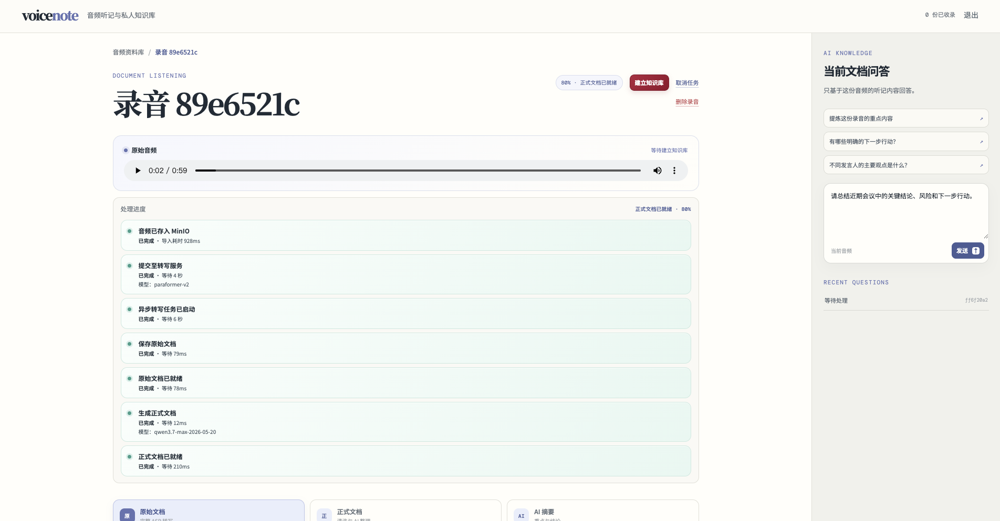
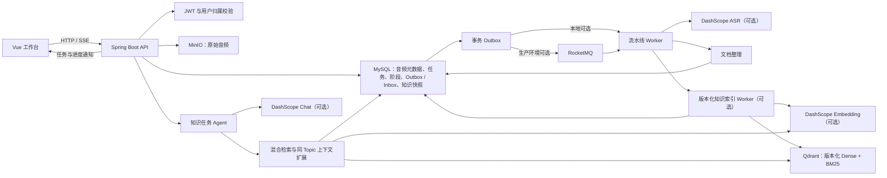
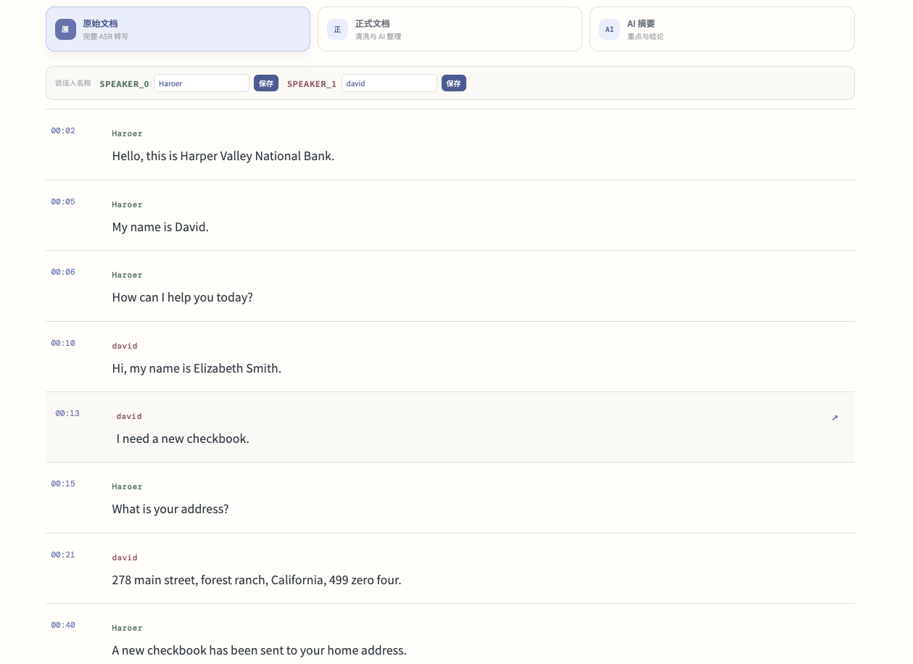

# voice note

> 面向会议、面试与访谈的 AI 听记和个人知识库

voicenote 将上传的音频保存为带时间轴的听记记录，并把完成的转写整理为可阅读、可追溯的文档。它面向“录了很多、回看很难”的场景：既能回到具体音频片段核对原文，也能围绕单份听记或已收录的资料库提问。

当前版本的主链路是：上传音频 → 异步转写 → 原始文档（完整转写）→ 手动生成正式文档 → 可选 AI 摘要 → 手动建立或重建版本化知识索引 → 证据可回跳的问答。项目正在持续开发，外部 ASR、向量检索和模型能力需要按环境单独启用。



*录音详情工作台：处理阶段、原始音频、文档视图和当前文档问答汇集在同一页面。*

## 当前能力

| 能力 | 已实现的行为 |
| --- | --- |
| 音频导入 | 创建上传意图时按用户和音频 SHA-256 复用内容记录；流式上传时重新计算 SHA-256，校验通过后才允许创建听记任务。 |
| 异步听记 | 任务创建立即返回，不等待 ASR 完成。转写、文档整理、知识构建由持久化任务和消息事件驱动；每个阶段的状态、尝试次数与失败信息可查询。 |
| 说话人和时间轴 | 导入时可开启说话人识别并选填人数；转写段保存时间范围、段序号与说话人信息，用户可为说话人补充名称，并从段落或证据回到对应音频时间。 |
| 原始文档 | 听记完成后显示完整 ASR 转写。每段转写都带时间戳、说话人和原文内容，并在对象存储保留 ASR 原始结果文件。 |
| 正式文档 | 用户确认后生成按主题组织的清洗文档，内容区分对话与问答对，保留来源转写段和可播放的时间位置。 |
| AI 摘要 | 正式文档完成后可按需生成摘要，呈现核心结论和分项要点；每项可通过“回到原文”定位其依据。 |
| 当前文档问答 | 在录音详情页提问时，模型只阅读当前音频的听记内容；回答和发现均附带可回跳的原文证据。 |
| 私有知识库 | 用户确认后，系统从正式文档快照生成 Topic 和知识块，并建立独立索引版本。每个版本分别记录入库、切块和索引进度；只有激活版本可供检索。 |
| 跨文档问答 | 在资料库视图提问时，系统以 Dense 语义检索和 BM25 关键词检索融合候选，再读取同一 Topic 内的邻近上下文；答案中的每条证据都会校验为它实际读取过的转写段。 |
| 实时进度 | 工作台通过认证后的 SSE 接收听记阶段、三阶段知识索引构建和知识任务完成通知。 |

> **当前边界：**账号密码登录与 JWT 用户隔离已经实现；这不是一个具备组织、角色或权限管理的多租户后台。启用 `DASHSCOPE_ENABLED` 后才会调用 ASR、Embedding 和对话模型；启用 `VOICENOTE_KNOWLEDGE_ENABLED` 后才会执行向量知识构建。

## 架构概览



任务的权威状态在 MySQL；RocketMQ 按至少一次投递处理，而不是作为状态来源。RocketMQ 未启用时，应用仍可使用进程内消息发布器驱动开发环境的 Worker。知识索引的 Topic、Chunk、阶段尝试和活动版本指针也持久化在 MySQL；Qdrant 仅存放带版本、用户与可检索标记的向量及过滤元数据。

## 从音频到答案

1. 登录后导入音频；可选择是否识别说话人，并选填说话人数。客户端计算内容 SHA-256 后创建上传意图。
2. 上传完成后创建异步听记任务。详情页显示“音频已存入 MinIO、提交至转写服务、异步转写、保存原始文档”等阶段，以及进度、等待时间、模型标识和可重试错误。
3. 原始文档准备好后，按时间轴浏览完整转写；为识别出的说话人填写名称，或点击任一段落回听相应原声。
4. 点击“生成正式文档”，系统将转写清洗并按主题、对话或问答对组织；每个主题仍保留可播放的起始时间。
5. 在正式文档完成后，可选生成 AI 摘要，并在详情页右侧对当前文档提问。摘要和问答的证据链接会回到对应原文段落。
6. 需要跨录音检索时，点击“建立知识库”。系统按“知识库入库 → 按主题切块 → 构建检索索引”创建一个新的索引版本。所有新点写入成功并标记为可检索后，才切换 MySQL 中的活动版本；已有活动版本在切换前继续服务查询。对于已收录文档，重建失败不会替换原有活动版本。
7. 在资料库视图提出问题时，系统仅在当前用户的活动索引版本中检索、读取和回答；证据链接仍会回到原始转写段和对应音频时间。

## 界面流程

### 1. 查看处理状态，并对当前录音提问

首图展示的录音详情页同时提供原音播放、流水线进度与当前文档问答。处理中的任务可显示各阶段状态；失败、未知或等待重试的可支持阶段可重新提交。

### 2. 核对原始转写与说话人

“原始文档”保留 ASR 的完整逐段结果。每一段均显示时间、说话人和文本；顶部可将 ASR 说话人 ID 保存为便于阅读的名称。



### 3. 阅读按主题整理的正式文档

“正式文档”将连续转写清洗为主题化内容，并标注对话或问答对。主题标题可跳回相应的原始音频时间，方便在阅读结论时核对上下文。


### 4. 提取可追溯的 AI 摘要

“AI 摘要”先给出整段听记的概览，再按要点列出结论。每项下方的“回到原文”链接用于打开对应的转写证据，而非仅展示无法复核的生成内容。


## 本地启动

### 前置条件

- JDK 17、Maven 与 Node.js
- 可访问的 MySQL 与 MinIO
- 可选：RocketMQ（异步消息）、Qdrant（知识检索）、DashScope 凭据（ASR、Embedding、对话模型）

后端从 `backend/.env` 读取本地配置，进程环境变量优先级更高。复制示例文件后，将其中的占位值替换为本地环境值；不要提交真实凭据、私有地址或对象存储信息。

```bash
cd backend
cp .env.example .env
# 编辑 .env：至少配置 MySQL、MinIO 与 VOICENOTE_JWT_SECRET
mvn spring-boot:run
```

默认后端端口为 `8080`。另开一个终端启动前端：

```bash
cd frontend
npm install
npm run dev
```

### 按需启用外部能力

| 目标 | 配置 |
| --- | --- |
| 启用异步 MQ 消费 | `ROCKETMQ_ENABLED=true`，并配置 `VOICENOTE_ROCKETMQ_NAMESRV`。 |
| 启用 ASR、问答与向量 Embedding | `DASHSCOPE_ENABLED=true`，设置 `DASHSCOPE_API_KEY`，必要时调整模型名。 |
| 启用知识文档索引 | `VOICENOTE_KNOWLEDGE_ENABLED=true`，并配置可访问的 `VOICENOTE_QDRANT_URL`；若 Qdrant 启用了 API Key 认证，同时设置 `VOICENOTE_QDRANT_API_KEY`。应用会在建立知识库前检查连通性。 |

`backend/.env.example` 列出了完整的变量、默认模型名和本地端口示例。外部能力关闭时，应用不会主动连接 DashScope 或 RocketMQ；知识构建需要 Qdrant 与 Embedding 同时可用。

Qdrant 由开发或部署环境单独运行。启动后可请求其 `/healthz` 端点确认可用；若不可用，页面会保留正式文档并提示修复 Qdrant 后再点击“建立知识库”。

### 调整知识索引与检索参数

正式文档索引按模型报告的 Token 用量控制切块，而不是按固定字符数截断。以下变量均有 `backend/.env.example` 中的默认值；它们会影响新建索引版本，修改后需要再次发起“重建知识库”。

| 目的 | 有效配置与默认值 |
| --- | --- |
| Topic 合并与切块大小 | `VOICENOTE_KNOWLEDGE_SHORT_TOPIC_TOKENS=200`、`VOICENOTE_KNOWLEDGE_CHUNK_TARGET_TOKENS=800`、`VOICENOTE_KNOWLEDGE_CHUNK_MAX_TOKENS=1200`。连续短 Topic 会在不超过目标值时合并；单个超大 Topic 再向来源片段下钻。 |
| 混合检索候选 | `VOICENOTE_KNOWLEDGE_RETRIEVAL_PREFETCH_LIMIT=50`。Dense 与 BM25 分别取候选，再由 RRF 融合。 |
| 送入问答的上下文 | `VOICENOTE_KNOWLEDGE_RETRIEVAL_SEED_LIMIT=4`、`VOICENOTE_KNOWLEDGE_CONTEXT_MAX_CHUNKS=12`、`VOICENOTE_KNOWLEDGE_CONTEXT_MAX_TOKENS=10000`。每个种子最多扩展同一 Topic 中相邻的一个 Chunk，随后受总数和 Token 上限约束。 |

`VOICENOTE_KNOWLEDGE_CHUNK_CHARACTERS` 仅为旧版原始转写兼容路径保留；当前正式文档的知识构建使用上述 Topic 和 Token 配置。

## 关键设计

### 三层幂等，避免重复转写

同一用户上传相同内容时，`audio_blobs` 的 `(owner_id, sha256)` 唯一约束会复用音频记录；上传过程还会对实际字节流再做一次 SHA-256 校验。创建任务时，`Idempotency-Key` 与请求哈希一起保存，任务本身还以音频、ASR 配置和流水线版本形成语义唯一键。这样可同时处理重复点击、并发建单和重放请求，避免不必要地再次提交 ASR。

相关实现：

- [UploadService](backend/src/main/java/com/voicenote/service/UploadService.java)：创建或复用上传意图，并对上传字节流校验摘要。
- [TranscriptionTaskService](backend/src/main/java/com/voicenote/service/TranscriptionTaskService.java)：以请求幂等记录和语义键创建任务。
- [V1 初始表结构](backend/src/main/resources/db/migration/V1__initial_schema.sql)：声明音频、请求幂等记录与听记任务的唯一约束。

### 持久化阶段状态与可靠投递

任务创建和 Outbox 事件写入同一事务。Dispatcher 将待投递事件送往 RocketMQ；消费者使用 Inbox 的 `(consumer_name, message_id)` 唯一约束去重。每个处理阶段都有独立尝试记录，Worker 重启后会恢复仍在排队或应重试的工作；未知的 ASR 提交结果不会自动再次提交，避免外部模型调用不确定时产生重复成本。

相关实现：

- [OutboxService](backend/src/main/java/com/voicenote/service/OutboxService.java)：创建带去重键的 Outbox 事件。
- [TaskMessageHandler](backend/src/main/java/com/voicenote/messaging/TaskMessageHandler.java)：在消费端登记 Inbox 并分派任务事件。
- [PipelineProgressService](backend/src/main/java/com/voicenote/service/PipelineProgressService.java)：维护阶段状态、进度和阶段级重试。
- [PipelineRecoveryCoordinator](backend/src/main/java/com/voicenote/service/PipelineRecoveryCoordinator.java)：定期恢复可继续执行的任务。

### 按 Topic 快照保留语义边界

知识构建先从正式文档提取并持久化 Topic 快照；每个快照包含来源区块、说话人、转写段、时间范围和文本。知识块从这些快照生成，而非按固定字符数机械截断。默认一个 Topic 对应一个 Chunk；连续且都很短的 Topic 会合并，以减少过碎召回，同时通过关联表保留每个 Chunk 覆盖的全部 Topic。过大的 Topic 再向来源片段下钻；是否需要切分由 Embedding 提供方返回的 Token 用量和目标/最大 Token 配置共同决定。

相关实现：

- [KnowledgeChunker](backend/src/main/java/com/voicenote/service/KnowledgeChunker.java)：从整理文档创建 Topic 快照、合并短 Topic，并按模型 Token 用量生成带来源片段的知识块。
- [V11 知识索引迁移](backend/src/main/resources/db/migration/V11__add_versioned_knowledge_index.sql)：定义 Topic、Chunk–Topic 关联和版本化索引表。

### 版本化构建与逻辑切换

每次建立或重建都会创建独立的 generation：它记录正式文档版本，并将切块策略、Embedding 模型和向量维度写入配置哈希。MySQL 保存该 generation 的 Topic/Chunk 快照，以及“知识库入库、按主题切块、构建检索索引”三个阶段的尝试和进度。Worker 先以 `searchable=false` 写入新版本的全部 Qdrant 点；写入成功后才开启新版本的可检索标记并更新知识文档的活动版本指针。查询还会在 MySQL 中复核 Chunk 所属的活动版本，因此新旧版本的短暂并存不会混入同一次回答；被替换版本随后下线。

相关实现：

- [KnowledgeDocumentService](backend/src/main/java/com/voicenote/service/KnowledgeDocumentService.java)：创建 generation、保存阶段进度并切换活动版本。
- [KnowledgeIndexWorker](backend/src/main/java/com/voicenote/service/KnowledgeIndexWorker.java)：写入向量、开启新版本检索并下线旧版本。
- [KnowledgeDocumentController](backend/src/main/java/com/voicenote/web/KnowledgeDocumentController.java)：提供重建和索引版本查询接口。

### 双路检索、同 Topic 上下文与证据边界

转写、文档整理、切片与索引由阶段流水线编排；跨文档问答才创建独立的知识任务。检索时 Qdrant 对同一问题同时执行 Dense 向量和 BM25 稀疏检索，以 RRF 融合结果，并以 `ownerId` 与 `searchable=true` 过滤。服务端随后验证命中 Chunk、文档所有者和活动索引版本，再从最多四个种子向同一 Topic 内扩展相邻 Chunk，受最大 Chunk 数和 Token 总量限制。

当前知识任务 Worker 固定执行“检索、读取扩展上下文”两步，并记录在最多四次的工具预算内；模型不会获得任意外部工具。只有实际读取的 Chunk 会进入提示上下文，服务端拒绝引用未读取的 Chunk、缺失证据或不属于该 Chunk 的转写段。这将可恢复的索引流水线与受控的开放式问答分开。

相关实现：

- [QdrantKnowledgeVectorStore](backend/src/main/java/com/voicenote/service/QdrantKnowledgeVectorStore.java)：维护 Dense + BM25 的 RRF 查询，以及版本化可检索过滤。
- [KnowledgeSearchService](backend/src/main/java/com/voicenote/service/KnowledgeSearchService.java)：复核活动版本、按 Topic 扩展邻近上下文并施加上下文上限。
- [KnowledgeAgentWorker](backend/src/main/java/com/voicenote/service/KnowledgeAgentWorker.java)：执行固定的检索与读取步骤，再将已读上下文交给模型。
- [KnowledgeAgentService](backend/src/main/java/com/voicenote/service/KnowledgeAgentService.java)：限制工具预算并校验结果中的转写段证据。

## 项目结构

```text
.
├── backend/
│   ├── src/main/java/com/voicenote/  # API、领域模型、Worker、消息与外部 Provider
│   ├── src/main/resources/db/        # Flyway 迁移
│   └── .env.example                  # 本地配置模板
├── frontend/
│   └── src/                          # Vue 工作台与 API 客户端
├── docs/images/                      # README 展示图
└── scripts/                          # 本地开发辅助脚本
```

## 验证

后端包含状态机、幂等、上传、对象存储、知识切片和 Agent 证据校验等单元测试；前端构建同时执行 Vue 类型检查。

```bash
cd backend
mvn test

cd ../frontend
npm run build
```

## 开发边界与后续工作

- 本项目仍处于开发阶段，必须在真实音频集与目标问题集上再评估转写、检索和问答质量；README 不声明未在仓库中复现的 Hit@5 或其他指标。
- 外部服务由开发环境单独提供，仓库未包含 Docker Compose 或生产部署配置。
- 角色管理、多租户协作、生产可观测性与端到端效果评测尚不在当前 README 所描述的实现范围内。

## 安全说明

音频、知识文档和检索结果按已认证用户隔离。将数据库、对象存储、模型服务和消息服务的真实地址及凭据只保留在忽略的 `backend/.env` 或部署环境变量中，切勿提交到仓库。
