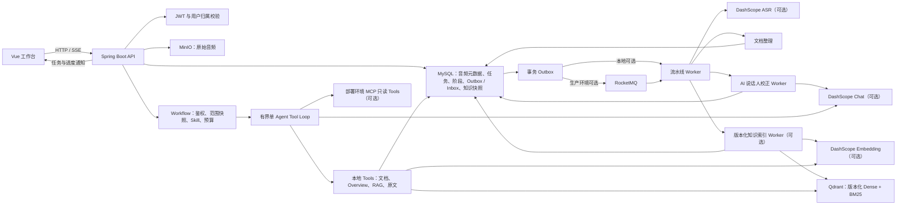

# voice note

> 面向会议、面试与访谈的 AI 听记和个人知识库

voicenote 将上传的音频保存为带时间轴的听记记录，并把完成的转写整理为可阅读、可追溯的文档。它面向“录了很多、回看很难”的场景：既能回到具体音频片段核对原文，也能围绕单份听记或已收录的资料库提问。

当前版本的主链路是：上传音频 → 异步转写 → 原始文档与可选说话人校正 → 手动生成正式文档 → 可选 AI 摘要 → 手动建立或重建版本化知识索引 → 由 Skill 约束、证据可回跳的 Agent 问答。项目正在持续开发，外部 ASR、向量检索和模型能力需要按环境单独启用。


*录音详情工作台：处理阶段、原始音频、文档视图和当前文档问答汇集在同一页面。*

## 当前能力

| 能力 | 已实现的行为 |
| --- | --- |
| 音频导入 | 创建上传意图时按用户和音频 SHA-256 复用内容记录；流式上传时重新计算 SHA-256，校验通过后才允许创建听记任务。 |
| 异步听记 | 任务创建立即返回，不等待 ASR 完成。转写、文档整理、知识构建由持久化任务和消息事件驱动；每个阶段的状态、尝试次数与失败信息可查询。 |
| 说话人和时间轴 | 导入时可开启说话人识别并选填人数；转写段保存时间范围、段序号与 ASR 原始说话人。用户可人工改派句段，也可触发 AI 从语义生成整段改派或句内拆分建议，确认后再应用，并从段落或证据回到对应音频时间。 |
| 原始文档 | 听记完成后显示完整 ASR 转写。每段转写都带时间戳、说话人和原文内容，并在对象存储保留 ASR 原始结果文件。 |
| 正式文档 | 用户确认后先按固定规则清洗并合并同说话人片段，再由模型按 Topic、问答对或叙述单元整理。每个清洗后发言只出现一次，正文保留完整原意、来源转写段和可播放的时间位置，不以摘要替代原文。 |
| AI 摘要 | 正式文档完成后可按需生成摘要，呈现核心结论和分项要点；每项可通过“回到原文”定位其依据。 |
| 自主知识 Agent | 每次提问创建独立的有界 Run。自研 ReAct 状态机冻结用户、文档、索引版本、时区和 Skill；单 Agent 在预算内选择文档、概览、混合检索、原文上下文和最终校验工具。页面展示脱敏后的步骤与耗时，终态 Run 可从可重放 Checkpoint 创建子 Run，原轨迹保持不变。 |
| 私有知识库 | 用户确认后，系统从正式文档快照生成 Topic 和知识块，并建立独立索引版本。每个版本分别记录入库、切块和索引进度；只有激活版本可供检索。 |
| 单/多文档问答 | 支持当前文档、勾选 1–50 份文档或全部已收录文档。宽范围任务先分页读取版本化 Overview，再对最多 12 份文档执行 Dense + BM25 + RRF 检索和可选 Rerank。 |
| Skill 平台 | 内置知识问答、面试复盘和会议总结 v2；用户可在顶部 Skill 设置页手工创建或 AI 草拟私人 Draft，添加 Markdown 参考资料、模板与示例，执行触发测试后发布不可变版本。问答默认自动路由，也可从完整的已发布 Skill 列表手动覆盖；私人 Skill 可归档或永久删除。 |
| Skill 权限与只读 MCP | 私人 Skill 仅能组合平台固定结果区块，并使用本地只读工具；不支持脚本、Hook、网络、写操作或子 Agent。部署批准的 Streamable HTTP MCP 只读工具只允许内置 Skill 显式声明。 |
| Tools 中心 | 顶部独立页面展示当前进程实际注册的本地与 MCP 工具，并可按已发布 Skill 查看运行时实际可用权限和输入协议。页面只读，不提供工具执行或授权修改。 |
| 证据与覆盖率 | 工具来源登记为不可伪造的 `sourceRef`。内容结论至少引用一条本次读取的转写证据，服务端复核范围、索引版本、Chunk 与 Segment；结果披露概览、深入检索、引用和遗漏文档。 |
| 轻量个人中心 | 顶部账号入口打开独立页面，读取账号、注册时间、录音数、已收录数、Agent 问答数和私人 Skill 数，并提供退出登录。 |
| 实时进度 | 工作台通过认证后的 SSE 接收听记阶段、说话人校正、三阶段知识索引构建和知识任务完成通知；阶段详情保留排队、处理耗时、模型标识、失败信息和可重试状态。 |

> **当前边界：**账号密码登录与 JWT 用户隔离已经实现；这不是一个具备组织、角色或权限管理的多租户后台。Agent 由 `VOICENOTE_AGENT_ENABLED` 灰度启用，每个问题互相独立且没有会话记忆。私人 Skill 仅创建者可见，暂不支持导入导出、组织共享或市场；MCP 仍只支持后端配置的内置 Skill 只读 Tools。

## 架构概览



任务的权威状态在 MySQL；RocketMQ 按至少一次投递处理，而不是作为状态来源。RocketMQ 未启用时，应用仍可使用进程内消息发布器驱动开发环境的 Worker。知识索引的 Topic、Chunk、阶段尝试和活动版本指针也持久化在 MySQL；Qdrant 仅存放带版本、用户与可检索标记的向量及过滤元数据。

## 从音频到答案

1. 登录后导入音频；可选择是否识别说话人，并选填说话人数。客户端计算内容 SHA-256 后创建上传意图。
2. 上传完成后创建异步听记任务。详情页显示“音频已存入 MinIO、提交至转写服务、异步转写、保存原始文档”等阶段，以及进度、等待时间、模型标识和可重试错误。
3. 原始文档准备好后，按时间轴浏览完整转写；为识别出的说话人填写名称。可点击“AI 校正”异步分析整份原文，预览整段改派和句内拆分建议后选择应用；高置信建议默认勾选，估算出的拆分时间会明确标记。也可点击“修改说话人”进入人工校对模式，用 Shift 连续选择后批量改派。ASR 原标注始终保留，人工结果不会被后续 AI 覆盖。
4. 点击“生成正式文档”，系统先清理标点与空格、合并相邻同说话人片段，再按 Topic、问答对或叙述单元组织；服务端校验每个来源片段只出现一次且顺序不变，不接受摘要式正文。
5. 在正式文档完成后，可选生成 AI 摘要，并在详情页右侧对当前文档提问。摘要和问答的证据链接会回到对应原文段落。
6. 需要跨录音检索时，点击“建立知识库”。系统按“知识库入库 → 按主题切块 → 构建检索索引”创建一个新的索引版本。所有新点写入成功并标记为可检索后，才切换 MySQL 中的活动版本；已有活动版本在切换前继续服务查询。对于已收录文档，重建失败不会替换原有活动版本。
7. 通过顶部“Skill 设置”查看内置 Skill，或创建、测试并发布私人 Skill。私人 Skill 发布后默认手动；正负触发样例通过当前预览后才能加入自动路由。顶部“Tools 中心”可进一步核对全局工具目录和每个 Skill 的有效权限。
8. 在详情页选择当前文档，或在资料库勾选若干文档/选择全部范围后提问。默认发送 `skillId: null` 自动匹配，也可在问答区手动指定兼容 Skill。创建 Run 时系统冻结授权文档、活动索引版本、Skill 版本和业务元数据。
9. 回答展示服务端校验过的类型化区块、来源、文档覆盖率和折叠运行轨迹；旧版 `answer/findings` 结果仍可读取，转写证据仍可回到原始段落与音频时间。终态 Run 中标记为可重放的 Checkpoint 可创建子 Run 继续执行，不修改原 Run 与轨迹。

## 界面流程

### 1. 查看处理状态，并对当前录音提问

首图展示的录音详情页同时提供原音播放、流水线进度与当前文档问答。处理中的任务可显示各阶段状态；失败、未知或等待重试的可支持阶段可重新提交。

### 2. 展开每个异步处理阶段

处理进度不是一条笼统的百分比。页面分别展示音频入库、ASR 提交与轮询、原始文档保存、正式文档生成等阶段的状态，并保留排队时间、处理耗时和实际模型标识；失败时可据此判断应重试哪个阶段。


### 3. 在应用前审核 AI 说话人建议

“原始文档”保留 ASR 的完整逐段结果。每一段均显示时间、说话人和文本；顶部可将 ASR 说话人 ID 保存为便于阅读的名称。AI 校正只允许调整已有说话人的归属或在原文边界拆段，不能改写文字；结果先进入预览，用户选择后才落库。词级时间可用时拆分位置与原声对齐，否则显示“估算时间”。进入人工修改模式后可点击整条句子选择、连续批量改派，或用“重置所选”恢复 ASR 标注。纠错发生在正式文档生成之后时，旧摘要和知识索引会停用并提示重建。


### 4. 阅读按主题整理的正式文档

“正式文档”是完整转写的清洗整理稿，不是摘要。系统逐发言进行受约束的轻度润色，将明确问答组织为问答对，将讨论和独白保留为叙述单元；无法通过数字、技术标识、否定词和长度校验的润色会回退到规则清洗文本。主题标题可跳回相应的原始音频时间。


### 5. 提取可追溯的 AI 摘要

“AI 摘要”先给出整段听记的概览，再按要点列出结论。每项下方的“回到原文”链接用于打开对应的转写证据，而非仅展示无法复核的生成内容。


### 6. 用版本化 Skill 约束任务

Skill 设置页把任务目标、工作流、结果结构、参考资料和触发样例作为可审查配置管理。系统提供知识问答、面试复盘和会议总结等内置 Skill；私人 Skill 可手工创建，也可让 AI 只依据目标与示例生成 Draft，再经过触发预览和人工发布。未命中的 Skill 正文不会进入问答上下文。


### 7. 核对 Agent 的最小工具权限

Tools 中心读取当前进程真正注册的工具，而不是展示静态能力清单。切换 Skill 后可以查看其运行时可用工具、参数协议和拒绝原因；私人 Skill 只能申请平台允许的本地只读工具，部署环境 MCP 工具也必须同时通过服务端白名单与内置 Skill 声明。


### 8. 查看轨迹，并从稳定状态分支重跑

回答完成后可展开运行轨迹，查看 Skill 路由、模型决策、工具调用、耗时与 Token 用量。页面只展示持久化前已脱敏的可观察步骤，不暴露隐式推理；终态 Run 的可重放 Checkpoint 可创建保留剩余预算的子 Run，原 Run 和原轨迹不会被覆盖。


## 本地启动

### 前置条件

- JDK 17、Maven 与 Node.js
- 可访问的 MySQL 与 MinIO
- 可选：RocketMQ（异步消息）、Qdrant（知识检索）、DashScope 凭据（ASR、Embedding、对话模型）

后端从 `backend/.env` 读取本地配置，进程环境变量优先级更高。复制示例文件后，将其中的占位值替换为本地环境值；不要提交真实凭据、私有地址或对象存储信息。

```bash
cd backend
cp .env.example .env
# 编辑 .env：至少配置 MySQL、MinIO 与 VOICENOTE_JWT_SECRET
mvn spring-boot:run
```

默认后端端口为 `8080`。另开一个终端启动前端：

```bash
cd frontend
npm install
npm run dev
```

### 按需启用外部能力

| 目标 | 配置 |
| --- | --- |
| 启用异步 MQ 消费 | `ROCKETMQ_ENABLED=true`，并配置 `VOICENOTE_ROCKETMQ_NAMESRV`。 |
| 启用 ASR、问答与向量 Embedding | `DASHSCOPE_ENABLED=true`，设置 `DASHSCOPE_API_KEY`，必要时调整模型名。 |
| 启用知识文档索引 | `VOICENOTE_KNOWLEDGE_ENABLED=true`，并配置可访问的 `VOICENOTE_QDRANT_URL`；若 Qdrant 启用了 API Key 认证，同时设置 `VOICENOTE_QDRANT_API_KEY`。应用会在建立知识库前检查连通性。 |
| 灰度启用自主 Agent | `VOICENOTE_AGENT_ENABLED=true`。默认预算为 7 次模型调用、6 个 Agent 回合、10 次工具调用和 120 秒；单次 Tool 输出最多 32 KB。 |
| 启用文本 Rerank | `VOICENOTE_RERANK_ENABLED=true`，默认模型为 `qwen3-rerank`。调用失败时自动降级为 RRF，并在结果限制中披露。 |
| 启用只读 MCP | `VOICENOTE_MCP_ENABLED=true`，通过 `VOICENOTE_MCP_SERVERS` 配置 HTTPS/本机 HTTP 服务、认证环境变量名、只读工具与允许 Skill。连接失败时本地 Tools 仍可使用。 |

`backend/.env.example` 列出了完整的变量、默认模型名和本地端口示例。外部能力关闭时，应用不会主动连接 DashScope 或 RocketMQ；知识构建需要 Qdrant 与 Embedding 同时可用。

Qdrant 由开发或部署环境单独运行。启动后可请求其 `/healthz` 端点确认可用；若不可用，页面会保留正式文档并提示修复 Qdrant 后再点击“建立知识库”。

### 调整知识索引与检索参数

正式文档索引按模型报告的 Token 用量控制切块，而不是按固定字符数截断。以下变量均有 `backend/.env.example` 中的默认值；它们会影响新建索引版本，修改后需要再次发起“重建知识库”。

| 目的 | 有效配置与默认值 |
| --- | --- |
| Topic 合并与切块大小 | `VOICENOTE_KNOWLEDGE_SHORT_TOPIC_TOKENS=200`、`VOICENOTE_KNOWLEDGE_CHUNK_TARGET_TOKENS=800`、`VOICENOTE_KNOWLEDGE_CHUNK_MAX_TOKENS=1200`。短 Topic 会在不超过目标值时合并相邻 Topic；超大 Topic 只在问答对或叙述原子单元之间切分，单个超限原子独立保存。 |
| 混合检索候选 | `VOICENOTE_KNOWLEDGE_RETRIEVAL_PREFETCH_LIMIT=50`。Dense 与 BM25 分别取候选，再由 RRF 融合。 |
| 送入问答的上下文 | `VOICENOTE_KNOWLEDGE_RETRIEVAL_SEED_LIMIT=4`、`VOICENOTE_KNOWLEDGE_CONTEXT_MAX_CHUNKS=12`、`VOICENOTE_KNOWLEDGE_CONTEXT_MAX_TOKENS=10000`。每个种子最多扩展同一 Topic 中相邻的一个 Chunk，随后受总数和 Token 上限约束。 |

`VOICENOTE_KNOWLEDGE_CHUNK_CHARACTERS` 仅为旧版原始转写兼容路径保留；当前正式文档的知识构建使用上述 Topic 和 Token 配置。

MCP 配置只允许部署环境提供服务地址和认证环境变量名。例如（仅为不可解析的占位域名）：

```json
[{"name":"calendar","baseUrl":"https://mcp.example.invalid","endpoint":"/mcp","authorizationEnv":"CALENDAR_MCP_AUTHORIZATION","readOnlyTools":["list_events"],"allowedSkills":["meeting-summary"]}]
```

Agent 看到的工具名为 `mcp.calendar.list_events`。服务端不信任远端只读声明，也会阻止把已读取的转写原文直接作为 MCP 参数发送。

## 关键设计

### 三层幂等，避免重复转写

同一用户上传相同内容时，`audio_blobs` 的 `(owner_id, sha256)` 唯一约束会复用音频记录；上传过程还会对实际字节流再做一次 SHA-256 校验。创建任务时，`Idempotency-Key` 与请求哈希一起保存，任务本身还以音频、ASR 配置和流水线版本形成语义唯一键。这样可同时处理重复点击、并发建单和重放请求，避免不必要地再次提交 ASR。

相关实现：

- [UploadService](backend/src/main/java/com/voicenote/service/UploadService.java)：创建或复用上传意图，并对上传字节流校验摘要。
- [TranscriptionTaskService](backend/src/main/java/com/voicenote/service/TranscriptionTaskService.java)：以请求幂等记录和语义键创建任务。
- [V1 初始表结构](backend/src/main/resources/db/migration/V1__initial_schema.sql)：声明音频、请求幂等记录与听记任务的唯一约束。

### 持久化阶段状态与可靠投递

任务创建和 Outbox 事件写入同一事务。Dispatcher 将待投递事件送往 RocketMQ；消费者使用 Inbox 的 `(consumer_name, message_id)` 唯一约束去重。每个处理阶段都有独立尝试记录，Worker 重启后会恢复仍在排队或应重试的工作；未知的 ASR 提交结果不会自动再次提交，避免外部模型调用不确定时产生重复成本。

相关实现：

- [OutboxService](backend/src/main/java/com/voicenote/service/OutboxService.java)：创建带去重键的 Outbox 事件。
- [TaskMessageHandler](backend/src/main/java/com/voicenote/messaging/TaskMessageHandler.java)：在消费端登记 Inbox 并分派任务事件。
- [PipelineProgressService](backend/src/main/java/com/voicenote/service/PipelineProgressService.java)：维护阶段状态、进度和阶段级重试。
- [PipelineRecoveryCoordinator](backend/src/main/java/com/voicenote/service/PipelineRecoveryCoordinator.java)：定期恢复可继续执行的任务。

### AI 只提出说话人修订，人负责落库

AI 校正创建独立 Run，并冻结转写版本、当前修订号和原文快照哈希；异步 Worker 只能在已有说话人集合中提出整段改派或句内拆分，不能生成替换文本。建议保存置信度、理由与时间来源，高置信项仅默认勾选而不会自动应用。提交所选建议时服务端再次校验 Run 状态、建议归属与修订号；并发人工修改会让旧建议失效，人工校正过的片段也不会被后续 AI 覆盖。

相关实现：

- [SpeakerCorrectionService](backend/src/main/java/com/voicenote/service/SpeakerCorrectionService.java)：冻结输入快照、幂等创建 Run，并在应用前执行版本与建议归属校验。
- [SpeakerCorrectionWorker](backend/src/main/java/com/voicenote/service/SpeakerCorrectionWorker.java)：分块调用模型、约束候选说话人，并将模型结果解析为可审核建议。
- [SpeakerCorrectionTimingAligner](backend/src/main/java/com/voicenote/service/SpeakerCorrectionTimingAligner.java)：优先使用词级时间对齐句内拆分，无法精确对齐时显式记录估算来源。
- [speaker-correction-v1 Prompt](backend/src/main/resources/prompts/speaker-correction-v1.md)：版本化保存模型任务、边界和 JSON 输出协议。
- [V19 说话人校正 Run 迁移](backend/src/main/resources/db/migration/V19__add_ai_speaker_correction_runs.sql)：定义 Run、调用记录与建议的持久化结构。

### 按 Topic 快照保留语义边界

知识构建先从正式文档提取并持久化 Topic 快照；每个快照包含来源区块类型、说话人、转写段、时间范围和完整文本。知识块从这些快照生成，而非按固定字符数机械截断。默认一个 Topic 对应一个 Chunk；过短 Topic 在目标 Token 内与相邻 Topic 合并，同时通过关联表保留全部 Topic。过大的 Topic 只在 `QA_PAIR` 或 `NARRATIVE` 原子单元之间切分，绝不拆散一组问答；单个原子超过上限时独立保存并标记 `oversized`。Chunk 正文持久化在 MySQL，同一文本同时用于 Dense Embedding 和 Qdrant multilingual BM25。

相关实现：

- [KnowledgeChunker](backend/src/main/java/com/voicenote/service/KnowledgeChunker.java)：从整理文档创建 Topic 快照、合并短 Topic，并按模型 Token 用量生成带来源片段的知识块。
- [V11 知识索引迁移](backend/src/main/resources/db/migration/V11__add_versioned_knowledge_index.sql)：定义 Topic、Chunk–Topic 关联和版本化索引表。

### 版本化构建与逻辑切换

每次建立或重建都会创建独立的 generation：它记录正式文档版本，并将切块策略、Embedding 模型和向量维度写入配置哈希。MySQL 保存该 generation 的 Topic/Chunk 快照，以及“知识库入库、按主题切块、构建检索索引”三个阶段的尝试和进度。Worker 先以 `searchable=false` 写入新版本的全部 Qdrant 点；写入成功后才开启新版本的可检索标记并更新知识文档的活动版本指针。查询还会在 MySQL 中复核 Chunk 所属的活动版本，因此新旧版本的短暂并存不会混入同一次回答；被替换版本随后下线。

相关实现：

- [KnowledgeDocumentService](backend/src/main/java/com/voicenote/service/KnowledgeDocumentService.java)：创建 generation、保存阶段进度并切换活动版本。
- [KnowledgeIndexWorker](backend/src/main/java/com/voicenote/service/KnowledgeIndexWorker.java)：写入向量、开启新版本检索并下线旧版本。
- [KnowledgeDocumentController](backend/src/main/java/com/voicenote/web/KnowledgeDocumentController.java)：提供重建和索引版本查询接口。

### 有界单 Agent、覆盖率检索与证据边界

每次提问都是独立 Agent Run。Workflow 先确定不可变的用户与文档范围，保存活动索引版本、元数据、Skill 版本 ID、快照和哈希；模型只决定调用哪个 allowlist Tool 以及搜索内容，不能提交 ownerId 或扩张文档范围。自动路由只加载 Catalog 元数据和正负触发样例，Skill 命中后才加载 Instructions；资源只暴露名称与用途，正文由 `skill_resource_read` 每次最多读取 8 KB。

`AgentRuntime` 以 `ROUTING → MODEL_DECISION → TOOL_EXECUTION → FINALIZE/TERMINAL` 执行可测试的 ReAct 状态机。MySQL 保存 Run、完整可观察 Step 和不可变 Checkpoint；Checkpoint 包含模型、Prompt/Skill、文档/索引、证据和已消耗预算快照，并使用 SHA-256 验证完整性。租约过期时，旧 Step 转为 `INTERRUPTED`，execution epoch 递增后从最新 Checkpoint 恢复；旧 Worker 的迟到结果不能再提交。终态 Run 可从稳定 Checkpoint 创建保留剩余预算的子 Run，原 Trace 不变。Trace 在持久化前会清理凭据和内网地址；隐式推理不会保存或展示。这套实现不依赖 LangGraph、Langfuse、LangChain 或 OpenTelemetry。

问答能力与知识索引状态分开计算：原始转写完成即可进行当前文档问答；正式文档未入库时使用冻结的主题概览辅助定位；只有活动索引版本可以进入勾选或全部资料的跨文档范围。页面会分别标识“原文定位”“正式文档辅助”和“知识库检索”，不会把未入库资料悄悄纳入全库搜索。

`KnowledgeSearchTool` 对指定的每份文档分别执行 Dense + BM25 + RRF，每份保留最多四个候选，总候选池最多 50。选择最终上下文时先为有命中的目标文档保留一个结果，再按重排分数和单文档配额补充，最终受 12 个 Chunk 与 10,000 Token 限制。当前文档尚未建立索引时，`TranscriptContextTool` 直接对冻结的转写版本执行本地 BM25；全文读取同样受 10,000 Token 和 Tool 输出大小限制，超长原文的全局总结会披露覆盖不足并建议先生成正式文档。

所有 Tool 产生的来源先进入持久化证据账本。`FinalizeAnswerTool` 根据当前 Skill 动态限制 `SUMMARY`、`FINDINGS`、`DECISIONS`、`ACTION_ITEMS`、`OPEN_QUESTIONS`、`QA_REVIEW`、`ASSESSMENT_MATRIX` 与 `COMPARISON_TABLE`，只接受账本内的随机 `sourceRef`；每条事实项必须至少引用一个转写来源，未观察到的评价用 `NOT_OBSERVED`。完成事务再次复核 Run 范围、文档、索引版本、Chunk、Segment 和结果路径后才保存回答；前端同时兼容 v2 区块和旧结果。

相关实现：

- [QdrantKnowledgeVectorStore](backend/src/main/java/com/voicenote/service/QdrantKnowledgeVectorStore.java)：维护 Dense + BM25 的 RRF 查询，以及版本化可检索过滤。
- [KnowledgeSearchService](backend/src/main/java/com/voicenote/service/KnowledgeSearchService.java)：复核活动版本、按 Topic 扩展邻近上下文并施加上下文上限。
- [DocumentQaPolicy](backend/src/main/java/com/voicenote/service/DocumentQaPolicy.java)：根据原文、正式文档和活动索引分别派生当前问答与跨文档检索能力。
- [AgentRuntime](backend/src/main/java/com/voicenote/service/AgentRuntime.java)：执行版本化 ReAct 状态机、多轮 Tool Call、预算和终止条件。
- [KnowledgeAgentWorker](backend/src/main/java/com/voicenote/service/KnowledgeAgentWorker.java)：领取租约，保留 Legacy 路径并将新 Run 分派给 Runtime。
- [KnowledgeAgentService](backend/src/main/java/com/voicenote/service/KnowledgeAgentService.java)：创建范围/Skill 快照，原子持久化 Step、Checkpoint 与账本，处理恢复 epoch、分支重放和最终证据校验。
- [V16 Agent Trace 迁移](backend/src/main/resources/db/migration/V16__add_agent_trace_checkpoints.sql)：定义 lineage、执行 epoch、结构化失败和不可变 Checkpoint。
- [SkillService](backend/src/main/java/com/voicenote/service/SkillService.java)：管理私人 Draft、版本发布、资源限制、触发预览、自动启用和所有者隔离。
- [内置 Agent Skills](backend/src/main/resources/agent-skills)：仓库版本化的通用问答、面试复盘和会议总结清单。
- [Agent 评测说明](docs/agent-evaluation.md)：小型评测集、脱敏结果格式与指标计算方式。

## 项目结构

```text
.
├── backend/
│   ├── src/main/java/com/voicenote/  # API、领域模型、Worker、消息与外部 Provider
│   ├── src/main/resources/agent-skills/ # 内置 Skill、模板、参考资料与示例
│   ├── src/main/resources/db/        # Flyway 迁移
│   ├── src/main/resources/prompts/   # 版本化模型 Prompt
│   └── .env.example                  # 本地配置模板
├── frontend/
│   └── src/                          # Vue 工作台与 API 客户端
├── docs/images/                      # README 展示图
└── scripts/                          # 本地开发辅助脚本
```

## 验证

后端包含状态机、幂等、上传、对象存储、知识切片、工具参数边界和 Agent 证据校验等单元测试；前端构建同时执行 Vue 类型检查。

```bash
cd backend
mvn test

cd ../frontend
npm run build
```

## 开发边界与后续工作

- 本项目仍处于开发阶段，必须在真实音频集与目标问题集上再评估转写、检索和问答质量；README 不声明未在仓库中复现的 Hit@5 或其他指标。
- 外部服务由开发环境单独提供，仓库未包含 Docker Compose 或生产部署配置。
- 角色管理、多租户协作和生产可观测性仍需结合部署平台实现；仓库提供评测集与指标脚本，但真实质量基线必须在目标模型、索引和脱敏业务数据上测量。

## 安全说明

音频、知识文档和检索结果按已认证用户隔离。将数据库、对象存储、模型服务和消息服务的真实地址及凭据只保留在忽略的 `backend/.env` 或部署环境变量中，切勿提交到仓库。
