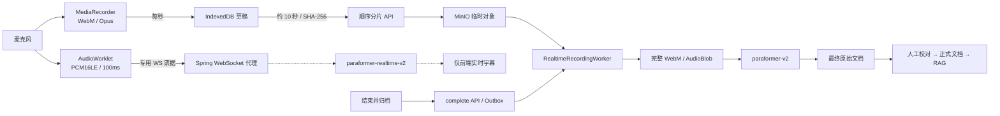
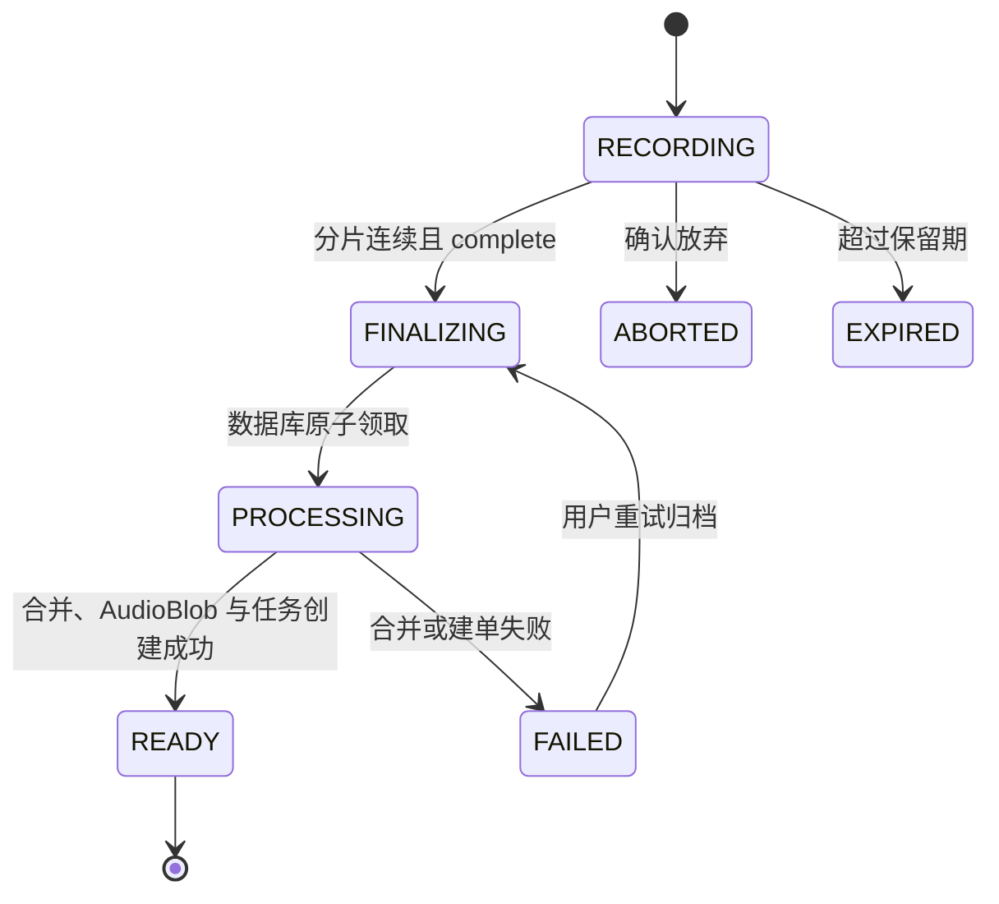

# 实时录音双转写与持续归档

实时录音把“用户此刻看到的字幕”和“长期沉淀的原始文档”明确分开。前者优先低延迟，允许临时结果替换、断线缺口和中途修正；后者只来自录音结束后的完整音频批量 ASR，并继续经过现有人工校对、正式文档和知识库关卡。

## 职责边界

| 数据 | 目标 | 生命周期 | 允许的下游 |
| --- | --- | --- | --- |
| `realtime_transcript` | 录音期间低延迟反馈 | 录音页面和 IndexedDB 草稿 | 仅字幕展示；临时句原位替换，final 句去重追加。 |
| `final_transcript` | 准确、稳定的长期记录 | 完整音频批量 ASR 后进入 MySQL | `TranscriptSegment`、原始文档、说话人校对、正式文档、摘要和 RAG。 |

实时事件不能调用最终转写持久化服务，也不能写入 `transcript_segments`。首版固定对完整音频重新调用 `paraformer-v2`；即使实时 ASR 返回 final sentence，也只保存在本地草稿用于录音页面恢复。

直接沉淀实时 final 只作为未来优化。启用前必须用同一批脱敏音频比较文字准确率、标点、时间戳、分段和说话人能力，并证明质量接近批量 ASR。

## 端到端链路



两条录音期间链路互不依赖。实时 ASR 连接失败或重连时，WebM 仍写入本地并持续尝试上传；音频上传失败时，PCM 字幕连接也可以继续。只有完整音频归档完成并创建现有 `TranscriptionTask` 后，系统才进入最终 ASR。

## 会话与分片状态

`realtime_recording_sessions` 保存所有权、开始时间、录音 MIME、采样率、语言、最终 ASR 配置、下一个分片序号、累计字节、最终 `audioBlobId/taskId`、失败信息和过期时间。



`realtime_recording_parts` 为每个服务端分片保存连续序号、MinIO 对象键、字节长度、SHA-256 和接收时间。数据库约束保证 `(session_id, part_number)` 唯一。

### 顺序和幂等规则

- 单个分片必须是非空 `application/octet-stream`，不超过 5 MB，并携带 `Content-Length`、`X-Content-SHA256` 和浏览器草稿持久化的 `Idempotency-Key`。
- 服务端只接受当前 `nextPartNumber`。跳号返回 `PART_OUT_OF_SEQUENCE`。
- 同一序号、长度和 SHA-256 完全一致的重试会幂等覆盖临时对象但不重复累计分片数和字节数；不同内容返回 `PART_CONTENT_CONFLICT`。
- 服务端读取请求体时重新计算 SHA-256；不一致会删除刚写入的临时对象并返回 `PART_HASH_MISMATCH`。
- `complete` 的 `partCount` 必须与服务端 `nextPartNumber` 相等，并且至少为 1。

## 归档 Worker

`RECORDING_FINALIZATION_REQUESTED` 通过现有 Outbox 发布；进程内 Publisher 和 RocketMQ 都路由到同一个 `TaskMessageHandler`，再启动 `RealtimeRecordingWorker`。

Worker 开始前必须通过数据库条件更新把会话从 FINALIZING 原子领取为 PROCESSING。进程内 Set 只用于减少本机重复工作，数据库状态才是跨实例、RocketMQ 重复投递和定时恢复之间的排他边界。超过租期的 PROCESSING 会话可以被恢复任务重新领取；旧 Worker 的乐观锁失败结果不能覆盖新 Worker 已经写入的 READY。

如果并发故障发生在“完整音频已经上传”之后，恢复任务会先检查确定性的完整音频对象键和字节数。对象完整时可直接重新计算 SHA-256、补建 `AudioBlob` 与最终转写任务，不再依赖已由另一个 Worker 清理的临时分片。

Worker 按以下顺序执行：

1. 检查分片数量、`0..N-1` 连续性和累计字节。
2. 依次读取每个 MinIO 临时对象到受控的服务端临时文件，同时计算整体 SHA-256 并校验总长度；读取全部完成后再单独上传完整 WebM，避免同一个 MinIO 客户端嵌套远程读写。临时文件在成功或失败后都会删除。
3. 按用户与内容哈希复用既有 `AudioBlob`，或创建 READY 状态的新对象记录。
4. 使用录音前选择的语言与说话人配置创建现有 `TranscriptionTask`，并把 `occurredAt` 更新为录音开始时间。
5. 会话进入 READY 后删除临时对象和分片行，向前端发布归档完成事件。

失败时会话进入 FAILED，但临时分片不删除。重复提交 `complete` 可以重新发起合并；现有任务语义键 `realtime-final-{sessionId}` 防止重复建单。

## HTTP API

所有 HTTP 接口都要求普通登录 JWT，并再次校验会话所有权。

| 方法 | 路径 | 说明 |
| --- | --- | --- |
| `GET` | `/api/realtime-recordings/capabilities` | 返回是否启用、时长上限、默认语言和不可用代码。 |
| `POST` | `/api/realtime-recordings` | 创建 RECORDING 会话，并返回 30 秒实时 WebSocket 票据。 |
| `PUT` | `/api/realtime-recordings/{sessionId}/parts/{partNumber}` | 顺序上传一个归档分片。 |
| `POST` | `/api/realtime-recordings/{sessionId}/complete` | 提交最终分片数；通常返回 `202 FINALIZING`。 |
| `GET` | `/api/realtime-recordings/{sessionId}` | 刷新恢复和轮询状态。 |
| `POST` | `/api/realtime-recordings/{sessionId}/realtime-ticket` | 为浏览器重连签发新票据。 |
| `DELETE` | `/api/realtime-recordings/{sessionId}` | 确认放弃未完成会话。 |

创建请求示例：

```json
{
  "startedAt": "2026-09-04T06:00:00Z",
  "contentType": "audio/webm;codecs=opus",
  "originalFilename": "实时录音_2026-09-04_14-00-00.webm",
  "sampleRate": 48000,
  "languageHints": ["zh", "en"],
  "asrConfig": {
    "languageHints": ["zh", "en"],
    "diarizationEnabled": true,
    "speakerCount": null
  }
}
```

## 实时 ASR WebSocket

路径为 `/api/realtime-recordings/socket`。浏览器在 `Sec-WebSocket-Protocol` 中同时发送：

- `voicenote.realtime.v1`：实际协商的应用子协议。
- `voicenote.ticket.{token}`：短期专用票据。

票据使用从登录 JWT secret 派生出的独立密钥，固定 `purpose`、用户和录音会话，不能替代普通登录 JWT。票据只用于握手，不应写入 URL、日志或持久化存储。

客户端发送 PCM16LE、单声道、实际 `AudioContext.sampleRate` 的二进制帧；每帧约 100 ms。结束时发送：

```json
{ "type": "finish" }
```

服务端事件：

| `type` | 关键字段 | 前端行为 |
| --- | --- | --- |
| `ready` | `sessionId` | 启动 MediaRecorder 并开始发送 PCM。 |
| `realtime_transcript` | `sequence`、`final`、`beginMs`、`endMs`、`text` | 临时句替换，final 句去重追加。 |
| `status` | `status`、`attempt` | 显示连接、重连或降级。 |
| `gap` | `beginMs`、`endMs`、`reason` | 提示字幕可能缺失，不影响归档。 |
| `error` | `code`、`message`、`recoverable` | 降级字幕；时长超限时安全结束。 |
| `finished` | 无 | 停止实时字幕状态。 |

后端使用 Java 17 `HttpClient.WebSocket` 代理上游，启用标点、VAD、心跳和实际采样率。上游断线按 500 ms、1 s、2 s 最多重连三次；重连期间收到的 PCM 不缓存到内存，以 `gap` 明确提示缺口。归档链路仍保存全部 WebM 音频。

上游消息结构以阿里云官方的 [Paraformer 客户端事件](https://help.aliyun.com/zh/model-studio/paraformer-client-events) 和 [服务端事件](https://help.aliyun.com/zh/model-studio/paraformer-server-events) 为准；服务端只在收到 `task-started` 后转发 PCM，并保持 `run-task` 与 `finish-task` 的 UUID 一致。

## 浏览器本地恢复

首版支持桌面 Chrome / Edge。`MediaRecorder` 每秒产生 WebM/Opus 块，先写入 IndexedDB；AudioWorklet 同时产生 PCM 帧。浏览器只在本地已经有十个完整块时上传常规分片，结束时再上传不足十秒的尾部分片。

用户点击“结束并归档”后，浏览器先同步停止 `MediaRecorder`、麦克风轨道、实时 PCM 和计时器，再等待本地分片写入与上传；对象存储或网络变慢不会继续占用麦克风。工作台分别展示“等待后台处理”和“校验并合并完整音频”，超过 30 秒只提示可以关闭窗口稍后查看，不会把仍在正常运行的任务误报为失败；本地副本会继续保留到服务端返回 READY。

服务端合并失败后，“继续归档”会从 IndexedDB 重新发送全部本地分片。同序号、长度和 SHA-256 相同的分片会幂等覆盖临时对象，但不会重复累计服务端分片数或字节数；因此数据库记录存在而 MinIO 临时对象缺失时也能恢复。

草稿保存：

- 服务端会话 ID、录音开始时间、MIME、采样率、语言和说话人配置。
- 本地块数量、已上传块数量、服务端下一个分片序号。
- 每个已确认服务端分片覆盖到的本地块边界，以及正在上传分片的边界和 SHA-256。
- 实时 final 字幕、草稿状态、错误和更新时间。

如果分片已经被服务端接受，但浏览器没有收到响应，刷新后会读取服务端 `nextPartNumber`，再用本地保存的 pending boundary 精确推进，不会把不足十秒的尾分片误当成完整十秒。网络中断时本地录音继续；页面重开后会把 RECORDING 草稿标记为 INTERRUPTED，并提供继续归档、下载本地副本和确认删除。

本地草稿只在服务端返回 READY 且包含任务 ID 后删除。关闭正在 FINALIZING 的工作台不会清理草稿，用户可从资料库恢复并继续轮询。
如果用户把合并转到后台，SSE 的 `realtime-recording-settled` 事件会清理匹配的本地草稿并自动打开新任务；事件丢失时仍可通过资料库恢复入口查询同一权威状态。

## 保留与清理

- 录音归档事件使用独立执行队列，避免被耗时较长的 Agent 或分析任务挤占。Worker 默认每 5 秒扫描已滞留 5 秒的 FINALIZING 会话并幂等重试（可通过 `app.realtime-asr.finalization-recovery-interval-ms` 覆盖），将即时投递异常时的恢复等待控制在约 5–10 秒；数据库状态领取仍负责阻止重复合并。
- RECORDING、FAILED 等未完成会话和临时分片保留 24 小时。
- READY 会话元数据保留 7 天，用于幂等状态查询。
- ABORTED 会话尽快进入定时清理。
- 完成归档后立即删除 MinIO 临时分片；完整音频遵循现有 `AudioBlob` 生命周期。
- 浏览器本地草稿由用户确认删除，或在 READY + task ID 后自动清理。

## 配置

实时录音依赖已有 DashScope API Key 和下列环境变量：

```text
DASHSCOPE_ENABLED=true
DASHSCOPE_API_KEY=<api-key>
VOICENOTE_REALTIME_ASR_ENABLED=true
DASHSCOPE_REALTIME_ASR_MODEL=paraformer-realtime-v2
VOICENOTE_REALTIME_ASR_MAX_DURATION_SECONDS=7200
VOICENOTE_REALTIME_ASR_TICKET_TTL_SECONDS=30
VOICENOTE_REALTIME_ASR_SENTENCE_SILENCE_MS=800
VOICENOTE_REALTIME_ASR_CONNECT_TIMEOUT_SECONDS=10
```

WebSocket 地址使用应用内公开默认值，只有部署确实需要覆盖时才通过 `VOICENOTE_REALTIME_ASR_WS_URL` 设置。真实密钥、私有 Workspace、对象存储路径和签名 URL 不得写入仓库、测试、截图或日志。

## 验证

自动化检查：

```bash
cd backend
mvn test

cd ../frontend
npm test
npm run build
```

后端单元测试覆盖顺序与重复分片、哈希冲突、跨用户访问、完整音频逐字节合并、失败保留和专用票据不能复用登录 JWT。前端使用 Vitest 与 `fake-indexeddb` 覆盖本地块顺序、离线草稿、账号隔离、服务端进度恢复、尾分片边界、字幕去重和完成清理。

仍需在启用真实 MinIO、DashScope、MySQL 与浏览器麦克风的目标环境手工验证：

- 麦克风拒绝、正常录音、实时临时/最终字幕。
- 实时 ASR 断线与三次重连、上传断网恢复、刷新恢复和 MinIO 失败。
- 两小时自动结束、下载本地副本、确认放弃。
- 完整音频可播放、最终原文来自批量 ASR、说话人分离和后续人工关卡。
- 进程内与 RocketMQ 两种投递模式。

完成上述浏览器矩阵后再向 `docs/images/` 添加实时录音工作台截图，避免用未验证的界面替代真实运行证据。
